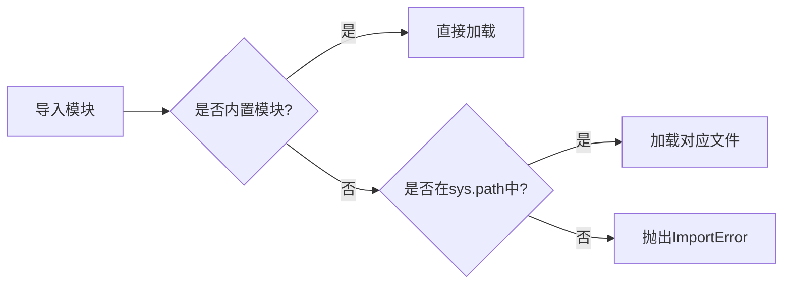

## 模块结构与规范

以下是以内建 `sys` 模块为例的标准模块模板：

```py
#!/usr/bin/env python3
# -*- coding: utf-8 -*-

""" 模块文档注释（使用三引号规范） """

__author__ = 'Michael Liao'

import sys

def test():
    args = sys.argv
    if len(args) == 1:
        print('Hello, world!')
    elif len(args) == 2:
        print(f'Hello, {args[1]}!')  # 更新为f-string格式化
    else:
        print('Too many arguments!')

if __name__ == '__main__':
    test()
```

第1行和第2行是标准注释，第1行注释可以让这个 `hello.py` 文件直接在 Unix/Linux/Mac 上运行，第2行注释表示.py文件本身使用标准 UTF-8 编码；

### 关键要素解析

1. **解释器声明**（第1行）：

   - 使脚本在Unix-like系统可直接执行（需`chmod +x hello.py`）

2. **编码声明**（第2行）：

   - Python 3默认UTF-8编码，但显式声明可确保跨版本兼容性

3. **模块文档**（第4行）：

   - 可通过`__doc__`属性访问（如`print(hello.__doc__)`）
   - 建议使用三引号多行字符串

4. **特殊变量**：

   - `__author__`：作者信息
   - `__name__`：当直接执行时值为`'__main__'`，被导入时为模块名

5. **执行控制**：

   ```py
   if __name__ == '__main__':  # 模块作为脚本直接运行时成立
       test()                  # 被导入时不执行
   ```

## 模块使用示例

### 命令行测试

```bash
$ python3 hello.py
Hello, world!
$ python3 hello.py Alice
Hello, Alice!
$ python3 hello.py Bob Charlie
Too many arguments!
```

### 交互环境测试

```py
>>> import hello          # 无输出
>>> hello.test()          # 显式调用函数
Hello, world!
>>> hello.__author__
'Michael Liao'
>>> hello.__doc__
' 模块文档注释（使用三引号规范） '
```

## 作用域控制

| 命名风格  | 示例        | 可见性规则                   |
| :-------- | :---------- | :--------------------------- |
| public    | `calculate` | 可被外部直接引用             |
| 特殊变量  | `__init__`  | 系统定义，不应自定义         |
| protected | `_internal` | 约定内部使用（实际仍可访问） |
| private   | `__private` | 类内使用（发生名称修饰）     |

### 封装示例

```py
def _format_greeting(name: str) -> str:
    return f'Hello, {name.title()}!'  # 内部格式化逻辑

def greet(name: str):
    """公开接口：执行参数检查"""
    if not name.isalpha():
        raise ValueError("姓名需全字母")
    return _format_greeting(name)
```

## 第三方模块管理

### 安装方式对比

| 工具     | 适用场景     | 示例命令               |
| :------- | :----------- | :--------------------- |
| pip      | 单个包安装   | `pip install requests` |
| conda    | 科学计算环境 | `conda install numpy`  |
| 虚拟环境 | 项目隔离依赖 | `python -m venv myenv` |

### 推荐工具链

1. **Anaconda**（科学计算）

   - 预装1500+数据科学包
   - 支持虚拟环境管理
   - 跨平台二进制依赖管理

2. **pip + venv**（通用开发）

   ```bash
   # 创建虚拟环境
   python -m venv .venv
   
   # 激活环境（Windows）
   .venv\Scripts\activate.bat
   
   # 安装包
   pip install Pillow==9.5.0
   ```

## 模块搜索机制

### 路径解析流程



### 路径管理策略

1. **临时添加**：

   ```py
   import sys
   sys.path.insert(0, '/custom/path')  # 优先搜索自定义路径
   ```

2. **永久配置**：

   ```bash
   # Linux/macOS
   export PYTHONPATH="/custom/path:$PYTHONPATH"
   
   # Windows
   setx PYTHONPATH "C:\custom\path;%PYTHONPATH%"
   ```

3. **开发模式安装**（推荐）：

   ```bash
   pip install -e .  # 通过setup.py配置
   ```

## 最佳实践建议

1. 模块命名

   - 使用小写字母+下划线（`data_processor.py`）
   - 避免与标准库同名（如勿命名`sys.py`）

2. 导入规范

   ```py
   # 优先使用绝对导入
   from package.submodule import feature
   
   # 避免通配符导入
   # 不推荐：from module import *
   ```

3. 版本兼容

   ```py
   # 在__init__.py中声明
   __version__ = '1.0.3'
   ```

4. 类型提示（Python 3.5+）

   ```py
   def process_data(data: list[str]) -> dict[str, float]:
       """处理数据并返回统计字典"""
       # 实现代码...
   ```

通过遵循这些规范和最佳实践，可以创建出结构清晰、易于维护的Python模块，并有效管理项目依赖。