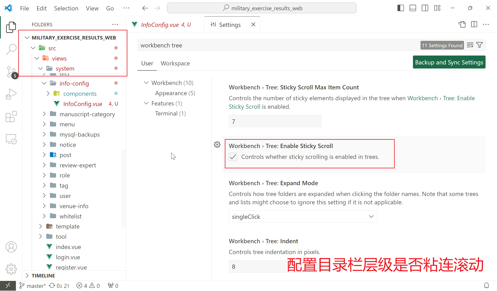

# VSCode 配置

配置目录层级是否粘连滚动



## 默认文件换行格式

在 settings.json 中添加

```json
{
  "files.eol": "\n"
}
```

它的可选值：

- `\n`：表示 LF（Unix、Linux 和 macOS 格式）。
- `\r\n`：表示 CRLF（Windows 格式）。
- `auto`：自动选择操作系统特定的行尾字符。

## 指定 TypeScript 的 TypeScript Server 的路径

TypeScript Server 是一个 TypeScript 编译器的后台进程，它负责处理 TypeScript 文件的语法分析、类型检查、自动补全等功能。当你在 VS Code 中编辑 TypeScript 文件时，这个服务器会为你提供实时的代码分析和提示。

使用 `typescript.tsdk` 配置项允许你指定 TypeScript Server 的位置，配置示例：

```json
{
  "typescript.tsdk": "./node_modules/typescript/lib"
}
```

## 代码保存时使用 ESLint/Stylelint 等

以下配置表示在保存文件时，ESLint/Stylelint 将只自动修复代码中的错误，而不会处理警告。

```json
{
  "editor.codeActionsOnSave": {
    "source.fixAll.eslint": "explicit",
    "source.fixAll.stylelint": "explicit"
  },
}
```

如果希望在保存时同时修复代码中的错误和警告，可以将配置项设置为 `"true"`。