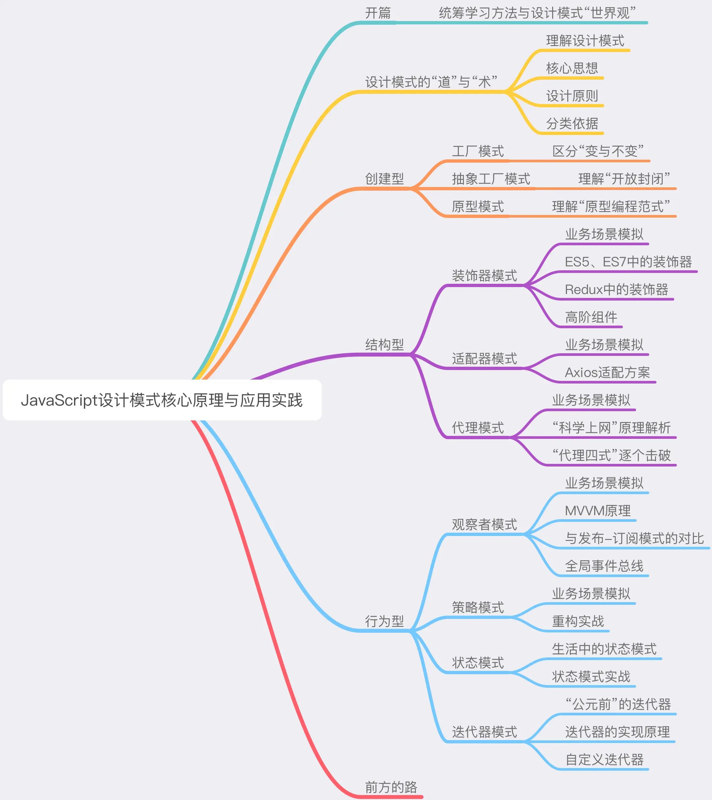
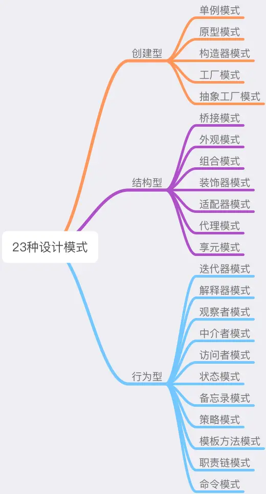

# JavaScript 设计模式笔记一

## 软件工程师

**“不变能力”中最基本的那一点**——**用健壮的代码去解决具体的问题的能力**：这个能力在软件工程领域所对标的经典知识体系，恰恰就是设计模式。

所以说，**想做靠谱开发，先掌握设计模式**。

## 驾驭技术的能力

- 能用健壮的代码去解决具体的问题；
- 能用抽象的思维去应对复杂的系统；
- 能用工程化的思想去规划更大规模的业务。

## 设计模式的学习之道

思维导图展示如下：

## 设计模式的道与术

设计模式是“拿来主义”在软件领域的贯彻实践。和很多人的主观臆断相反，设计模式不是一堆空空如也、晦涩鸡肋的理论，它是一套现成的工具 —— 就好像你想要做饭的时候，会拿起厨具直接烹饪，而不会自己去铸一口锅、磨一把菜刀一样。

用做数学题来打比方，可能大家会更能体会这种概念 —— 我们解题目的时候，往往会用到很多公式/现成的解题方法。比如已知直角三角形两边长，求另一边，我们会直接用勾股定理（我想应该没有人会每求一次边长都自己推一遍勾股定理才用吧）。

识别题目特征 —— catch题目想要考查的知识点 —— 快速在脑海中映射出它对应的解决方法，这个过程在我们学生时代几乎是一个本能的、条件反射一样的脑回路机制。在学习设计模式时，如果各位可以回忆起这种“从映射到默写”的思维方式，相信这个学习过程会是轻松的、自然的。

## SOLID设计原则

> "SOLID" 是由罗伯特·C·马丁在 21 世纪早期引入的记忆术首字母缩略字，指代了面向对象编程和面向对象设计的五个基本原则。

设计原则是设计模式的指导理论，它可以帮助我们规避不良的软件设计。SOLID 指代的五个基本原则分别是：

- 单一功能原则（Single Responsibility Principle）
- 开放封闭原则（Opened Closed Principle）
- 里式替换原则（Liskov Substitution Principle）
- 接口隔离原则（Interface Segregation Principle）
- 依赖反转原则（Dependency Inversion Principle）

## 设计模式的“术”

所谓“术”，其实就是指二十年前 GOF 提出的最经典的23种设计模式。二十年前，四位程序员前辈（Erich Gamma, Richard Helm, Ralph Johnson & John Vlissides）通过编写《设计模式：可复用面向对象软件的基础》这本书，阐述了设计模式领域的开创性成果。在这本书中，将23种设计模式按照“创建型”、“行为型”和“结构型”进行划分：

