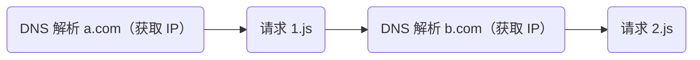
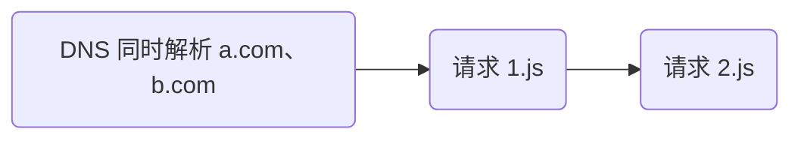

# 什么是连接复用

## Web 性能指标

当用户打开页面后的性能指标可以参考以下内容

- 有内容出现时
- **DOM ready 事件发生时**
- 页面可交互时
- onLoad 事件发生
- 动态资源加载完成


## DNS 预解析

假设 index.html 中有以下内容

```js
<script src="http://a.com/1.js"></script>
<script src="http://b.com/2.js"></script>
```

默认它们的执行步骤为



上面的步骤必须等待前一步执行完成后再执行下一步，但其实 DNS 解析域名部分可以优化为同时进行，如下



代码实现有两种方式。第一种是在 index.html 的 `<head>` 中添加以下内容（适合前端），如下

```html
<link rel="dns-prefetch" href="https://a.com/">
<link rel="dns-prefetch" href="https://b.com/">
```

第二种是在响应头中添加以下内容（适合后端），如下

```
Link: <https://a.com/>; rel=dns-prefetch, <https://b.com/>; rel=dns-prefetch
```

## TCP 优化

关于 TCP 的优化

### 连接复用

在请求头 & 响应头的第二部分都添加以下内容：

```
Connection: keep-alive
```

该方法可以让 TCP 连接复用，让 TCP 连接开启一次可以请求/响应多次。

其中，默认每次 HTTP 请求的间隔使用 KeepAlive 配置，如下

```js
KeepAlive: timeout=5,max=100
```

上面的内容表示可以等待的间隔为 5 秒，每次 TCP 连接最多请求 100 次

虽然服务器端（响应头）和浏览器端（请求头）都可以配置上面的属性，但浏览器理论上以服务器的配置为主，因为只有服务器支持，浏览器的该配置才能生效（当然 IE6 除外）。

TCP 连接复用对 HTTP 版本的支持：HTTP 1.1 默认添加该功能，HTTP 1.0 需要手动添加上面的配置

### 并发连接

- 上面的 TCP 连接复用，其实是串行的，这样一次只能发送一个请求，每次请求必须要等上一次请求完成。
- 但是其实可以添加并发请求，来优化请求，比如我们可以同时发送多个请求，假设同时发送了 6 个请求，这就叫并发连接。
- 并且并发连接可以和请求复用结合，当前 6 个请求完成后，我们可以继续复用前 6 个请求的 TCP 继续请求。

如何在浏览器中体现？可以找一个请求为 HTTP 1.1 版本的网页打开控制台，查看它们的 Connection ID 是否为同一个，同一个表示连接复用，如下：


### 管道化

管道化就是将上面的并发连接实现为一个 TCP 连接可以并发请求多次。但它有一个缺点，就是它的响应必须按照请求的顺序响应，也就是：如果我们按照顺序请求了 1.js、2.js、3.js 那么响应的时候，2.js 必须等待 1.js 响应完成后才能响应，3.js 也要等待 2.js 响应 