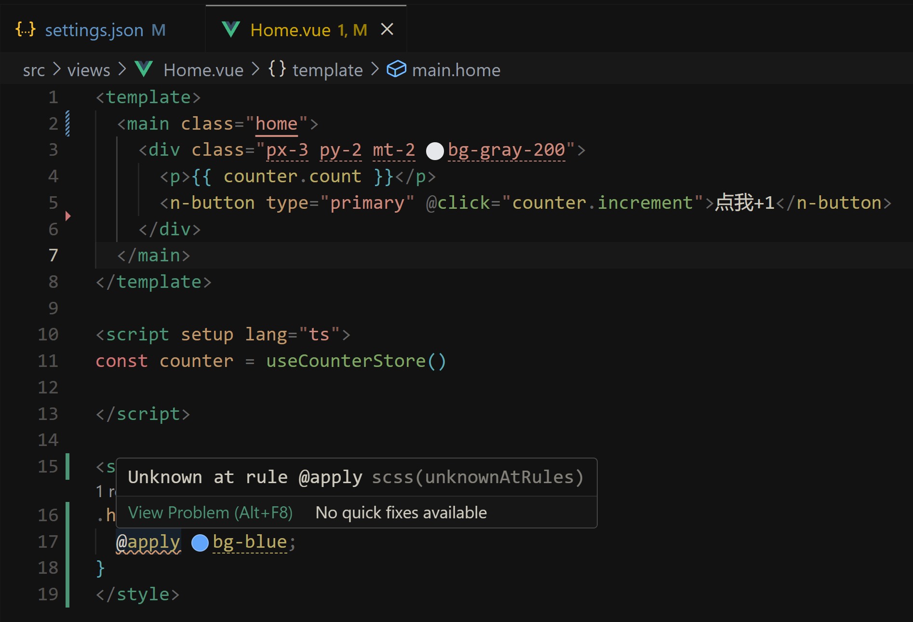

# VSCode 报错

## Unocss `Unknown at rule @apply scss(unknownAtRules)`

如下，该报错出现在 .vue 文件的 `<style>` 标签中使用 unocss @apply 语法，提示未知规则错误



可以在 `.vscode/settings.json` 中添加如下内容，避免该提示：

```json
{
  "scss.lint.unknownAtRules": "ignore",
}
```
