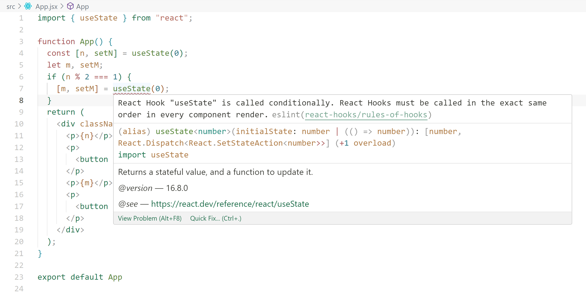

# 从零开始，解密 useState

本文将通过一系列简单的示例来逐步演示如何实现 useState，以及在使用 useState 中遇到的问题，以帮助你快速理解 useState 实现原理和应用。

## useState 用法

首先，在 React 中，useState 的用法如下：

```jsx
import { useState } from "react"

function App() {
  const [n, setN] = useState(0)
  return (
    <div className="App">
      <p>{n}</p>
      <div>
        <button onClick={() => setN(n + 1)}>+1</button>
      </div>
    </div>
  )
}
```

分析上面的代码，你会发现以下特点：

1. setN 一定会改变数据，将 n + 1 重新存入某个地方。
2. setN 会触发 `<App/>` 重新渲染（re-render）。
3. useState 会从缓存的数据中获取最新的 n。

## 实现 useState

根据以上原理，我们可以实现一个简单 useState。

```js
function useState(initialValue) {
  let state = initialValue
  function setState(newState) {
    state = newState
    render()
  }
}

function render() {
  return ReactDOM.render(<App/>, rootElement)
}

function App() {
  const [n, setN] = useState(0)
  return (
    <div className="App">
      <p>{n}</p>
      <div>
        <button onClick={() => setN(n + 1)}>+1</button>
      </div>
    </div>
  )
}

ReactDOM.render(App/>, rootElement)
```

但，如果你运行上面的代码，会发现点击按钮 n 没有任何变化。这说明我们对 state 的实现有误。

state 不能存储在 useState 函数中，因为 useState 会将 state 重置。我们需要一个不会被 useState 重置的变量，也就是一个外部变量，俗称闭包。再次改良我们的 useState，如下：

```js
let _state

function useState(initialValue) {
  _state = _state === undefined ? initialValue : _state
  function setState(newState) {
    _state = newState
    render()
  }
  return [_state, setState]
}
```

上面的代码，我们将 _state 提取为一个外部变量，这样每次 useState 就不会重置 state。至此，我们已经实现了一个非常简易的 useState。

但目前的实现仍然存在问题，例如我们同时使用两个 useState：

```js
import React from "react"
import ReactDOM from "react-dom"
const rootElement = document.getElementById("root")

let _state

function useState(initialValue) {
  _state = _state === undefined ? initialValue : _state
  function setState(newState) {
    _state = newState
    render()
  }
  return [_state, setState]
}

function render() {
  return ReactDOM.render(<App/>, rootElement)
}

function App() {
  const [a, setA] = useState(0)
  const [b, setB] = useState(0)
  return (
    <div className="App">
      <p>{a}</p>
      <div>
        <button onClick={() => setA(a + 1)}>+1</button>
      </div>
      <p>{b}</p>
      <div>
        <button onClick={() => setB(b + 1)}>+1</button>
      </div>
    </div>
  )
}

ReactDOM.render(<App/>, rootElement)
```

运行上面的代码，会发现，不论点击哪个按钮 a、b 都会同时改变。这是由于，我们将所有数据都放在一个 _state 中，导致 state 冲突。

首先想到的一种方案是：将 _state 改为一个 hash 对象，将值与每个 useState 一一对应，如 `_state = { a: 0, b: 0 }`，但我们并不知道变量 a、b 的属性名是什么，所以这个方法有缺陷。

一种更好的方案是：把 _state 存储在一个数组中，如 `_state = [0, 0]`，这样可以保证数据一一对应，再次改良我们的 useState，如下：

```js
let _state = []
let index = 0

function useState(initialValue) {
  const currentIndex = index
  index += 1
  _state[currentIndex] = _state[currentIndex] || initialValue
  function setState(newState) {
    _state[currentIndex] = newState
    render()
  }
  return [_state[currentIndex], setState]
}

function render() {
  index = 0
  return ReactDOM.render(<App/>, rootElement)
}

// App 内容
function App() {
  ...
}

ReactDOM.render(<App/>, rootElement)
```

再次运行，两个 useState 之间就不会相互影响了。至此，我们已经实现了一个单个组件可用的 useState。

最后，上面的代码只支持单个组件，如果有多个组件怎么办？

- 答案是每个组件都创建一个 _state 和 index。

但又有一个问题，这么多 _state 和 index 存放在哪里？重名了怎么办？

- 答案是可以存放在每个组件对应的虚拟 DOM 对象上。 

## 总结 useState 的实现

1. 每个 React Component 函数都会对应一个 React 虚拟节点（对象）。
2. 我们可以给每个节点保存独立的 state 和 index。
3. useState 会读取对应的 state（state[index]）。
4. 其中 index 由 useState 出现的顺序决定。
5. setState 会修改 state，并且触发更新。

> 注：本文对 `React.useState` 的实现做了简化，实际上 React 虚拟节点是 FiberNode，_state 的真实名称应为 memorizedState，index 的实现用到了链表。感兴趣可以查看[阅读源码后，来讲讲React Hooks是怎么实现的](https://juejin.cn/post/6844903704437456909#heading-0)。


讲完了 useState 的实现，我们再来分析 useState 的常见问题，或者说它不太符合预期的地方。

## 为什么不能在 if 中使用 useState？

让我们运行如下代码：

```js
import { useState } from "react"

fucntion App() {
  const [a, setA] = useState(0)
  let b, setB
  if (n % 2 === 1) {
    [b, setB] = useState(0)
  }

  return (
    <div className="App">
      <p>{a}</p>
      <div>
        <button onClick={() => setA(a + 1)}>+1</button>
      </div>
      <p>{b}</p>
      <div>
        <button onClick={() => setB(b + 1)}>+1</button>
      </div>
    </div>
  )
}
```

上面的代码，如果你添加了 TypeScript 或 React 的 ESLint 规则提示，会报如下错误：



<!-- 内容大意为：useState 被有条件的调用，React Hooks 必须在每次渲染以相同的顺序调用。 -->

这是因为：在 React 中，如果第一次渲染时 a 是第一个，b 是第二个，可能还有第三个 c...。那么，第二次渲染时，必须保证 useState 的顺序与第一次是完全一致的。所以 React 中不允许出现上面的代码。

## 关于 state

创建一个按钮 +1 功能，并添加 log，它会在 3 秒后打印当前 n，如下：

```js
import { useState } from "react"

function App() {
  const [n, setN] = useState(0)
  const log = () => setTimeout(() => console.log(`n: ${n}`), 3000)
  return (
    <div>
      <p>{n}</p>
      <div>
        <button onClick={() => setN(n + 1)}>+1</button>
        <button onClick={log}>log</button>
      </div>
    </div>
  )
}

// mount ReactDOM ...
```

我们依次点击 +1 按钮和 log 按钮，控制台会在 3 秒后输出 `n: 1`。

但如果我们先点击 log 按钮，再点击 +1 按钮，会发现 控制台输出的是 `n: 0`。

**为什么会这样？**

- 根据我们对 useState 的实现分析，是因为我们每次点击后重新 render 时，useState 返回的都是一个新的 `n`。
- 这样就会导致，我们运行的 log 函数中绑定的 n 还是重新 render 之前的 n。所以必须在点击后再 log，保证每次 log 之前的 n 是最新的。

但，我希望我的 n 总是最新的，怎么办？

我们可以使用 useRef，如下：

```js
import { useState, useRef } from "react"

function App() {
  const nRef = useRef(0)
  const update = useState()[1]
  const log = () => setTimeout(() => console.log(`n: ${nRef.current}`), 1000)
  return (
    <div className="App">
      <p>{nRef.current}</p>
      <p>
        <button onClick={() => ((nRef.current += 1), update(nRef.current))}>
          +1
        </button>
        <button onClick={log}>log</button>
      </p>
    </div>
  )
}

// mount ReactDOM ...
```

利用 useState 每次会重新 render 的功能和 useRef 相结合，就可以实现既能拿到最新 n，又可以重新 render。

如果你使用过 Vue3 的 Composition API。你就会发现，上面的方式与 Vue 的 ref 很像。实际上，Vue3 就是借鉴了 React Hooks 的思想，结合了数据响应式实现的 ref。

<p align="center">完~</p>
