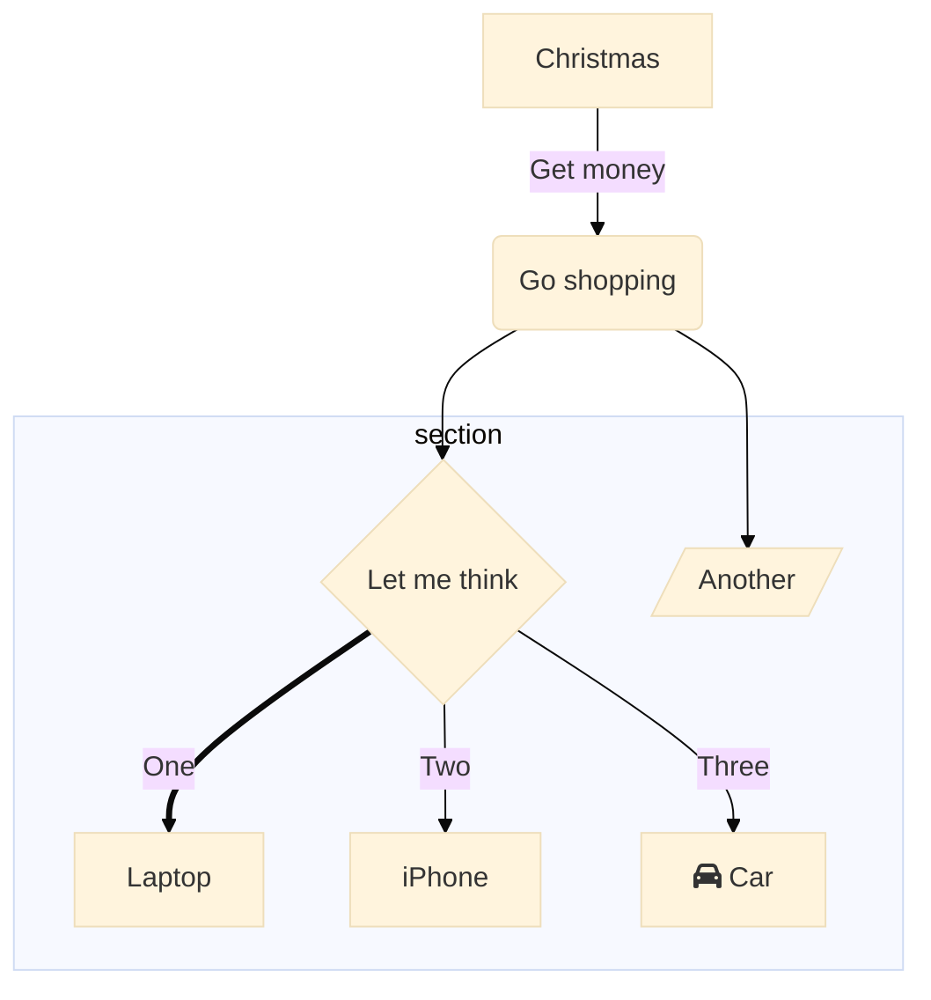

# HTTP

HTTP 协议 URL 不支持 # 锚点参数，默认 # 后的内容都会去除 

http 请求

```
GET HTTP/1.1
Accept: text/html
Host: baidu.com
Connection: keep-alive
Content-Type: application/json
\r\n（回车+换行）
{ "name": "Jack" }
```

http 响应

```
HTTP/1.1 200 OK
Content-Type: 
Set-Cookie: session_id=xxx;expires...
Connection: kee-alive
Content-Encoding: gzip
\r\n（回车+换行）
...
```

Content-Type 写法格式查阅 MIME Type


