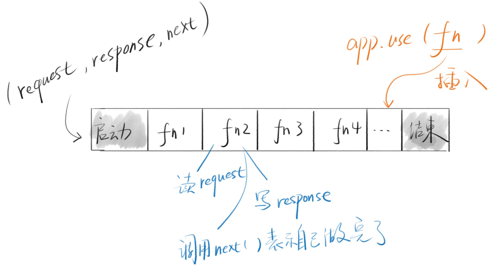

<!-- ---
title: Express 核心
date: 2021-12-02T21:39:43+08:00
tags:
  - Node.js
  - Express
--- -->

# Express 全解

## Express

历史：2010 年 6 月，TJ 开始编写 Express，2014 年发展到 v0.12，基本成熟，移交 StrongLoop。

Express 中间件模型



## 创建一个 Express 项目

```sh
mkdir express-demo
cd express-demo
yarn init -y
yarn install express
```

创建 app.js 文件

```js
// app.js
const express = require('express')
const app = express()
const port = 3000

app.get('/', (req, res) => {
  res.send('Hello World!')
})

app.listen(port, () => {
  console.log(`Example app listening at http://localhost:${port}`)
})
```

运行 app.js

```sh
node app.js
```

安装类型文件

```sh
yarn add -D @types/express
```

将 app.js 改为 app.ts

```ts {1}
// app.ts
import express from 'express'

const app = express()
const port = 4000

app.get('/', (request, response) => {
  response.send('你好！')
})

app.get('/demo', (request, response) => {
  response.send('你好，Demo!')
})

app.listen(port, () => {
  console.log(`Example app listening at http://localhost:${port}`)
})
```


## 使用 express-generator

**安装**

```sh
yarn global add express-generator
```

**使用**

```sh
express -h # 查看帮助
express --view=ejs . # 使用 ejs 模板在当前目录创建，运行后会覆盖之前的 package.json
```

**运行**

```sh
# 重新初始化
yarn install

# 运行
yarn start
```

重新安装 类型声明文件

```sh
yarn add -D @types/express @types/node
```

## 让 express 支持 TypeScript

安装 TypeScript 运行依赖

```sh
yarn add -D typescript ts-node-dev
```

修改 package.json 中的脚本

```json
{
  "scripts": {
    "dev": "ts-node-dev ./bin/www"
  },
}
```


## 使用 `app.use()`

使用 `app.use()` 发送数据

```js
app.use((request, response, next) => {
  response.send('hi')
  next()
})

app.use((request, response, next) => {
  response.send('hi')
  next()
})

// 结束
app.use((request, response, next) => {
  response.end('hi')
})
```

每次使用完 use 都要调用 next，才能进入下一个 use。

send 表示一次性发送所有数据，我们还可以使用 write，表示使用流发送，每次都可以发送一点点

```js
app.use((request, response, next) => {
  response.write('hi1')
  next()
})

app.use((request, response, next) => {
  response.write('hi2')
  next()
})

// 结束
app.use((request, response, next) => {
  response.end('hi')
})
```

## 中间件

`app.use()` 就是中间件的实现

实现一个 logger 中间件，每次运行都打印当前环境监听的地址

```js
const logger = (perfix) => (request, response, next) => {
  console.log(`${perfix}: ${request.url}`)
  next()
}

// 使用
app.use(logger('dev'))
```

使用 app.use 实现路由

```js
app.use((request, response, next) => {
  if (request.path === '/xxx' && request.method === 'get') {
    response.write('home')
  }
  next()
})

// 更便捷的写法（这些都是 API 的语法糖）
app.use('/xxx', fn)
app.get('/xxx', fn)
app.post('/xxx', fn)
app.route('/xxx').all(fn).get(fn2).post(fn3)
```

## 错误处理

一个简单的错误处理

```js
const errorState = true

app.use((request, response, next) => {
  console.log(1)
  next()
})

app.use((request, response, next) => {
  console.log(2)
  if (errorState) {
    next('未登录')
  } else {
    next()
  }
})

app.use((request, response, next) => {
  console.log(3)
  next()
})

app.use((error, request, response, next) => {
  if (response.headersSent) {
    console.log(response.headersSent)
    return next(error)
  }
  response.status(500)
  response.send(error)
})
```

可以调用多个错误处理，它们会像中间件一样连续调用

```js
const errorState = true

app.use((request, response, next) => {
  console.log(1)
  next()
})

app.use((request, response, next) => {
  console.log(2)
  if (errorState) {
    next('未登录')
  } else {
    next()
  }
})

app.use((request, response, next) => {
  console.log(3)
  next()
})

app.use((error, request, response, next) => {
  console.log(error)
  next(error)
})

let count = 0
app.use((error, request, response, next) => {
  count+=1
  console.log(`目前有 ${count} 个错误`)
  next(error)
})
```

## express 常用 API

- `express.json()` *
- `express.raw()`
- `express.Router()` *
- `express.static()` *
- `express.text()`
- `express.urlencoded()`

### `express.json()`

用于接口请求的参数，假如使用 postman 发送一个 body 为 `{ "name": "Jack", "age": 18 }` 的 JSON 数据

```js
// 监听 data 事件获取
app.use((request, response, next) => {
  console.log('request.body')
  console.log(request.body)
  // undefined
  request.on('data', (chunk) => {
    console.log(chunk.toString())
    // { name: 'Jack', age: 18 }
  })
})

// 使用 express.json() API 获取
app.use(express.json())

app.use((request, response, next) => {
  console.log('request.body')
  console.log(request.body)
  // { name: 'Jack', age: 18 }
  next()
})
```

### `express.static()`

访问指定目录的静态文件，例如添加 public 目录下的文件为可访问的

```js
app.use(express.static('public'))
```

现在，可以访问位于 public 目录中的文件：

```sh
# 访问 ./public../_images/demo.jpg
http://localhost:3000../_images/demo.jpg

# 访问 ./public/css/style.css
http://localhost:3000/css/style.css
```

### `express.urlencoded()`

处理参数类型为 `x-www-form-urlencoded` 的请求


## app.xxx

重点 API

- `app.set('views' | 'view engine', xxx)`
- `app.get('env')`
- `app.get('/xxx', fn)`
- `app.post、app.put、app.delete...`
- `app.render()`
- `app.use()`

### `app.set()`

基本用法

```js
app.set('foo', true)
app.get('foo') // true
```

app.set 还内置了几个值，具体参考：https://expressjs.com/zh-cn/api.html#app.set

**开启大小写敏感（注意 app.set 要写在所有 app.use 的最上面）**

```js
app.set('case sensitive routing', true)

app.get('/style.css', (request, response, next) => {
  response.send('style.css')
})

app.get('/STYLE.css', (request, response, next) => {
  response.send('STYLE.css')
})

// 访问 http://localhost:3001/style.css，返回：style.css
// 访问 http://localhost:3001/STYLE.css，返回：STYLE.css
```

**配置渲染视图所在目录（默认为当前根目录下的 views 文件夹）**

```js
app.set('views', 'jack')
// 配置渲染模板，需要安装对应模板插件，如 npm i pug
app.set('view engine', 'pug')

app.get('/test', (request, response, next) => {
  response.render('test', { pageTitle: 'hello' })
})
```

创建 `jack/test.pug` 文件

```pug
doctype html
html(lang="zh-CN")
  head
    title= pageTitle
    script(type='text/javascript').
      if (foo) bar(1 + 5);
  body
    h1 Pug - node template engine
```

访问 `http://localhost:3001/test`，返回如下内容

```html
<!DOCTYPE html>
<html lang="zh-CN">
<head>
	<title>hello</title>
	<script type="text/javascript">
		if (foo) bar(1 + 5);
	</script>
</head>
<body>
	<h1>Pug - node template engine</h1>
</body>
</html>
```

**app.get / app.post / app.put / app.delete / app.patch**

```js
app.get('/test', (request, response, next) => {
  response.send('get test')
})

// 使用 app.use 实现
app.use((request, response, next) => {
  if (request.method === 'GET' && request.path === '/test') {
    response.send('get test')
  }
})
```

**app.locals**

用于存储公共数据，例如页面 title（可以 `request.app.locals` 方式使用）

```js
app.locals.title = '我的个人博客'

app.get('/test', (request, response, next) => {
  response.render('test', { pageTitle: request.app.locals.title })
})
```

## request.xxx

请求相关 API

### request.params

假如你的路由中包含 `/user/:id` 则 name 属性可用作 `request.params.id`，如下

```js
app.get('/users/:id', (request, response, next) => {
  console.log('request.params')
  console.log(request.params)
  response.send('hi')
  next()
})

// get 请求 `http://localhost:3000/users/1?name=jack`
// 得到 { id: '1' } 
```

### request.query

获取路由中查询字符串的参数，自动封装为一个对象

```js
app.get('/users/:id', (request, response, next) => {
  console.log('# request.query')
  console.log(request.query)
  response.send('hi')
  next()
})

// get 请求 `http://localhost:3000/users/1?name=jack&age=19`
// 得到 { name: 'jack', age: '19' }
```

### request.xhr

用于区分 XML Http Request 请求与普通请求

### request.range()

用于分片下载，详情查看 [MDN HTTP请求范围](https://developer.mozilla.org/zh-CN/docs/Web/HTTP/Range_requests)

以 [Neat](https://www.neatdownloadmanager.com/index.php/en/) 下载 [Cmder](https://cmder.net/) 为例


## response.xxx

响应相关 API

### response.get()

返回指定响应头的值

```js
res.get('Content-Type')
// => "text/plain"
```

### response.set()

用于设置响应头

```js
response.set('X-Jack', 'yes')
```

### response.status()

用于设置 HTTP 响应码

```js
res.status(403).end()
res.status(404).sendFile('/absolute/path/to/404.png')
```

### response.append()

追加一个响应头

```js
response.set('X-Jack', 'yes2')
```

### res.format(object)

设置支持的类型，如 `Accept: text/plain`、`Accept: text/html`

### res.location()

设置 响应头的 location 

### res.send()

发送一个消息体，注意不能与 `res.write()` 一起使用

### res.render()

渲染一个模板

### res.headersSent

检测之前的中间件是否调用过 `res.send()` API

## router

router 相当于一个小型的 app，但它只有路由的功能

创建 users 路径下的路由

```js
// app.js
const users = require('./routes/user')

app.use('/users', users)

// routes/users.js
const express = require('express')
const router = express.Router()

router.get('/', (req, res, next) => {
  res.send('/users')
})
router.get('/:id', (req, res, next) => {
  res.send('/users/:id')
})
router.get('/:id/edit', (req, res, next) => {
  res.send('/users/:id/edit')
})

module.exports = router
```