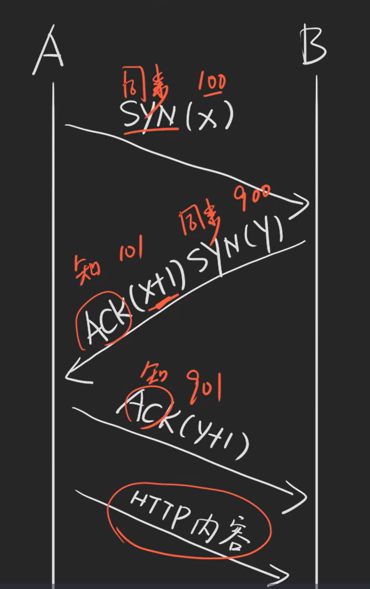
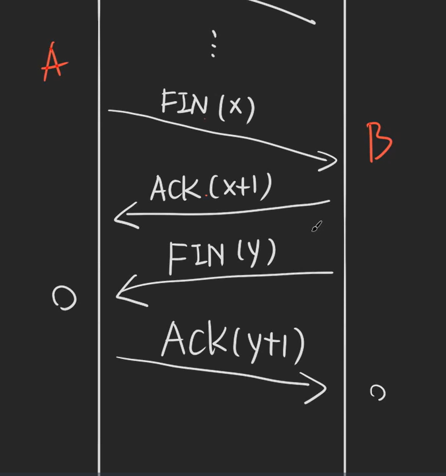

# HTTP 押题

## DNS 是什么？

全称 Domain Name System（域名系统），你给它一个域名，它给你返回一个 IP，浏览器拿到 IP 后，就会建立 TCP 连接。

## TCP 连接

全称 Transmission Control Protocol（**传输控制协议**），一种计算机网络中的通信方式。

TCP 连接是指使用 TCP 协议在网络上建立的一种可靠的双向通信链路。TCP（Transmission Control Protocol/**传输控制协议**）是一种面向连接、可靠的传输层协议，常用于互联网上的数据传输。

TCP 连接的建立和维护是通过三次握手和四次挥手来完成的。在 TCP 连接建立之后，通信双方可以通过 TCP 协议进行数据的可靠传输。

### 三次握手

**三次握手是 TCP 协议用于建立可靠连接的过程**，它确保了通信双方的发送和接收能力正常，以及双方的初始序列号（Sequence Number）的同步。下面是描述三次握手的过程：

1. 第一次握手（SYN）：

    客户端向服务器发送一个标志位为SYN（Synchronize）的 TCP 报文段，表示客户端请求建立连接。这个报文段中包含了客户端的初始序列号（ISN）。

2. 第二次握手（SYN + ACK）：

    服务器收到客户端的 SYN 报文段后，会发送一个带有 ACK（Acknowledgment）和 SYN 标志位的 TCP 报文段作为回应。ACK 标志位表示确认客户端的 SYN 报文段，而 SYN 标志位表示服务器也请求建立连接。服务器会为自己选择一个初始序列号（ISN），并将其包含在报文段中。

3. 第三次握手（ACK）：

    客户端收到服务器的 SYN + ACK 报文段后，会发送一个带有 ACK 标志位的 TCP 报文段作为确认。这个报文段中的 ACK 字段值为服务器的初始序列号加1，表示客户端已经确认了服务器的请求，连接建立成功。

此时，连接已经建立，双方都可以开始发送数据。



**为什么要有第三次连接？**

为了确定 A 可以回复（ACK），只有 A、B 都可以回复 TCP 连接才能建立成功。

### 四次挥手

**TCP 的连接的关闭过程被称为"四次挥手"**。下面是描述 HTTP 四次挥手的过程：

1. 客户端向服务器发送关闭连接请求：

    客户端发送一个 TCP 报文段，其中设置了 FIN（Finish）标志位，表示客户端已经完成数据的发送，并请求关闭连接。此时，客户端进入"半关闭"状态，即只能发送数据，不能再接收数据。

2. 服务器回复确认关闭请求：

    服务器收到关闭请求后，发送一个带有 ACK（Acknowledgment）和 FIN 标志位的 TCP 报文段，表示服务器已经接受了关闭请求，并且也准备关闭连接。此时，服务器进入相同的"半关闭"状态。

3. 服务器向客户端发送剩余的数据：

    如果服务器还有未发送完的数据，它会继续发送数据给客户端。这些数据会被客户端接收和处理。

4. 服务器发送关闭连接请求：

    当服务器完成数据的发送后，它会发送一个带有 FIN 标志位的 TCP 报文段，表示服务器已经完成数据的发送，并请求关闭连接。

5. 客户端回复确认关闭请求：

    客户端收到服务器的关闭请求后，发送一个带有 ACK 标志位的 TCP 报文段，表示客户端已经接受了关闭请求，并且连接即将关闭。

此时，连接正式关闭，双方都进入了"关闭"状态。双方都可以安全地关闭连接，并释放相关的资源。



**为什么四次挥手中间两次不能合并？**

两次回复的中间可能还会发送其他数据

## HTTP 状态码是什么，有哪些？

HTTP 状态码是由 Web 服务器发送给客户端的 3 位数字代码，它们指示所请求的网页的处理状态。以下是 HTTP 常用状态码：

- 1xx（消息）：服务器已接收到请求，需要客户端继续操作才能完成请求。
- 2xx（成功）：服务器已成功处理请求。
    - 200 OK：请求成功，返回的信息包含在响应中
    - 201 Created：请求已经被成功处理，并创建了新的资源
    - 204 No Content：请求已经被成功处理，但是返回的响应中没有实体的主体部分。
- 3xx（重定向）：需要客户端执行额外的操作才能完成请求。
    - 301 Moved Permanently（永久重定向）：请求的资源已经永久性地移动到新位置。
    - 302 Found（暂时重定向）：请求的资源已经暂时性地移动到新位置。
    - 304 Not Modified（未修改）：客户端请求的资源在上次请求后没有修改过，可以直接从缓存中取出。
- 4xx（客户端错误）：
    - 400 Bad Request：表示客户端请求的语法错误，服务器无法理解；
    - 401 Unauthorized：未认证，表示客户端未经认证，需要进行身份验证才能访问所请求的资源；
    - 403 Forbidden：没有访问权限，表示服务器拒绝了请求，一般是因为客户端没有访问权限；
    - 404 Not Found：表示所请求的资源不存在。
- 5xx（服务器错误状态码）：服务器处理请求出错。
    - 500 Internal Server Error：表示服务器内部错误，无法完成请求的处理。
    - 503 Service Unavailable：暂停服务，表示服务器过载或维护，暂时无法处理请求。

## GET 和 POST 的区别有哪些？

**区别一：幂等性**

1. 由于 GET 是读，POST 是写，所以 GET 是幂等的，POST 是不幂等的（幂等表示多次请求的结果一致）
2. 所以用浏览器打开网页会发送 GET 请求，想要 POST 打开网页要用 form 标签
3. GET 打开的页面刷新是无害的，POST 打开的 页面刷新需要确认
4. GET 结果会被缓存，POST 结果不会被缓存
5. GET 打开的页面可被书签收藏，POST 打开的不行

**区别二：请求参数**

1. 通常 GET 请求的参数放在 URL 里，POST 请求放在 body 消息体里（理论上 GET 请求也可以放在 body 里，POST 也可以放在 URL 里）
2. GET 比 POST 更不安全，因为参数直接暴露在 URL 上，所以不能用来传递敏感信息（其实 POST 放在消息体未做处理也不安全）
3. GET 请求参数放在 URL 里有长度限制，而 POST 放在 body 里没有长度限制（理论上都是有长度限制的，但是 POST 在 body 体中长度限制更宽泛）

**区别三：TCP Packet**

1. GET 产生一个 TCP 数据包，POST 产生两个或以上 TCP 数据包（由于）

> 根据技术规格文档，GET 和 POST 最大的区别是语义；但面试官一般问的是
实践过程中二者的区别，因此你需要了解服务器和浏览器对 GET 和 POST 的
常见实现方法。
> 

## HTTP 缓存有哪些方案

1. HTTP 1.1 强缓存：定义一个时间（毫秒数），在该时间内只用缓存的文件，并且把当前文件特征值记下。
2. HTTP 1.1 内容协商（弱缓存）：强缓存过期后，再次请求该文件时，附带特征值询问是否需要保留该文件（304 继续缓存，200 更新内容）。
3. 如何在缓存未过期前更新内容：
    1. 缓存的时间短一点
    2. 在URL中包含版本号或时间戳参数，以便客户端可以识别并请求最新的内容
    3. 强制刷新：在页面中添加一个手动刷新页面的按钮，在 JavaScript 中使用 **`location.reload()`** 可以绕过浏览器的缓存，从服务器获取最新的内容
4. 服务器处理请求：服务器接收到浏览器发送的HTTP请求后，会根据请求的内容进行处理。这可能涉及查询数据库、处理业务逻辑等操作。服务器生成HTTP响应，其中包含了请求的资源和其他相关信息。

|          | 缓存（强缓存）                                               | 内容协商（弱缓存）                                           |
| -------- | ------------------------------------------------------------ | ------------------------------------------------------------ |
| HTTP 1.1 | Cache-Control: max-age=3600<br>etag: ABC                     | If-Noe-Match: ABC<br>响应状态码：304 或 200                  |
| HTTP 1.0 | Expires: Wed, 21 Oct 2015 02:30:00 GMT<br>Last-Modified: Wed, 21 Oct 2015 01:00:00 GMT | If-Modified-Since: Wed, 21 Oct 2015 01:00:00 GMT<br>响应状态码：304 或者 200 |


### HTTP 1.1

缓存（强缓存）

- `cache-control: public, max-age=31536000` 表示缓存一年（一年内刷新页面都不会重新请求）
- `etag: ABC` 表示标记缓存的文件特征（MD5 哈希）

内容协商（弱缓存）

- `If-Noe-Match: ABC` 强缓存内容过期了，在请求时附带该字段，判断文件是否需要更新

### HTTP 1.0

缓存（强缓存）

- `Expires: Wed, 21 Oct 2015 02:30:00` 表示 2015 年的8月21号 凌晨 2:30 过期（缺陷：用户系统时间可能不正确）
- `Last-Modified: Wed, 21 Oct 2015 01:00:00 GMT` 文件特征值，内容是最后一次更新的时间

内容协商（弱缓存）

- `If-Modified-Since: Wed, 21 Oct 2015 01:00:00`  表示指定时间更新的文件，是否需要缓存

## HTTP 和 HTTPS 的区别有哪些？

> HTTPS = HTTP + SSL/TLS（安全层）
> 

### 区别列表

1. HTTP 是明文传输的，不安全；HTTPS 是加密传输的，非常安全。
2. HTTP 使用 80 端口，HTTPS 使用 443 端口。
3. HTTP 较快，HTTPS 较慢。
4. HTTPS 的证书一般需要购买（但也有免费的），HTTP 不需要证书。

HTTPS 的细节可以看网上的博客，比较复杂，难以记忆，建议写博客总结一下。

- [图解SSL/TLS协议](https://www.ruanyifeng.com/blog/2014/09/illustration-ssl.html)
- [HTTPS原理以及握手阶段](https://juejin.cn/post/6844903892765900814)

## HTTP/1.1 和 HTTP/2 的区别有哪些？

区别列表

1. HTTP/2 使用了**二进制传输**，而且将 head 和 body 分成帧来传输；HTTP/1.1 是字符串传输。
2. HTTP/2 支持**多路复用**，HTTP/1.1 不支持。多路复用简单来说就是一个 TCP 连接 从单车道（不是单行道）变成了几百个双向通行的车道。
3. HTTP/2 可以**压缩 head**，但是 HTTP/1.1 不行（HTTP/2 采用了一种称为 HPACK 的压缩算法来压缩头部）
4. HTTP/2 支持**服务器推送**，但 HTTP/1.1 不支持。（实际上没多少人用）

具体可以看我的课程《[全面攻克 Web 性能优化](https://xiedaimala.com/courses/b65a6488-4038-4676-932e-ae125613ad69/random/b9497c3e82?#/common)》

## 同源策略

### 同源策略是什么？

如果两个 URL 的协议、端口和域名都完全一致，则这两个 URL 是同源

```jsx
https://www.baidu.com:443/a
http://www.baidu.com:80/a
```

### 同源策略怎么做？

只要在**浏览器**里打开页面，就默认遵守同源策略。

### 优点

保证用户的隐私安全和数据安全

缺点

很多时候，前端需要访问另一个域名的后端接口，会被浏览器阻止其获取响应。

比如甲网站通过 AJAX 访问乙网站的 /money 查询余额，请求会发出，但是响应会被浏览器屏蔽

### 怎么解决缺点

使用跨域手段

1. JSONP（前端体系课有完整且详细的介绍）
    1. 甲站点利用 script 标签可以跨域的特性，向乙站点发送 get 请求。
    2. 乙站点后端改造 JS 文件的内容，将数据传进回调函数。
    3. 甲站点通过回调函数拿到乙站点的数据。
2. CORS
    1. 对于简单请求，乙站点在响应头里添加 `Access-Control-Allow-Origin:http://甲站点` 即可
    2. 对于复杂的请求，如 PATCH，乙站点需要：
       
        响应 OPTIONS 请求，在响应中添加如下的响应头
        
        ```jsx
        Access-Control-Allow-Origin: https://甲站点
        Access-Control-Allow-Methods: POST, GET, OPTIONS, PATCH
        Access-Control-Allow-Headers: Content-Type
        ```
        
        响应 POST 请求，在响应中添加 `Access-Control-Allow-Origin` 头
        
    3. 如果需要附带身份信息，JS 中需要在 AJAX 里设置 `xhr.withCredentials = true`
3. Nginx 代理 / Node.js 代理
    1. 前端 ⇒ 后端 ⇒ 另一个域名的后端

详情参考：[MDN CORS 文档](https://developer.mozilla.org/zh-CN/docs/Web/HTTP/CORS)

## Session、Cookie、LocalStorage、SessionStorage 的区别

### Cookie V.S. LocalStorage

1. 主要区别是 Cookie 会被发送到服务器，而 LocalStorage 不会
2. Cookie 一般最大 4k，LocalStorage 可以用 5Mb 甚至 10Mb（各浏览器不同）

### LocalStorage V.S. SessionStorage

1. LocalStorage 一般不会自动过期（除非用户手动清除）
2. SessionStorage 在回话结束时过期（如关闭浏览器之后，具体由浏览器自行决定）

### Cookie V.S. Session

1. Cookie 存在浏览器的文件里，Session 存在服务器的文件里
2. Session 是基于 Cookie 实现的，具体做法就是把 SessionID 存在 Cookie 里

## 使用 HTTP 发送一个请求的全流程

1. DNS解析：当你输入一个域名时，
    1. 浏览器会查看自己有没有缓存过网址的 IP
    2. 然后它会查看操作系统有没有域名对应的缓存 IP（hosts 文件）
    3. 然后才会去访问 ISP（移动、联通等服务商）
2. 建立 TCP 连接：然后浏览器根据 IP 与服务器建立 TCP 连接
3. 发起HTTP请求：一旦TCP连接建立，浏览器会向服务器发送HTTP 请求。HTTP请求中包含了要访问的资源的类型（例如网页、图像或视频）以及其他附加信息，如请求方法（GET、POST等）和请求头部。
4. 传输响应：服务器将生成的HTTP响应发送回浏览器。这个过程通过TCP连接进行，数据被分割成小的数据包并依次发送。
5. 浏览器接收响应：浏览器接收到来自服务器的HTTP响应后，会对响应进行解析。解析后的响应包括响应状态码、响应头部和响应体。
6. 渲染页面：如果响应的内容是一个HTML页面，浏览器会解析HTML代码，并加载其中的CSS和JavaScript等资源。浏览器使用解析后的数据构建DOM（文档对象模型）树，并将其呈现在用户界面上。
7. 关闭连接：一旦页面完成加载和渲染，浏览器会关闭与服务器的TCP连接。如果页面上存在其他资源（如图片、脚本等），则浏览器可能会继续发起额外的HTTP请求来获取这些资源。