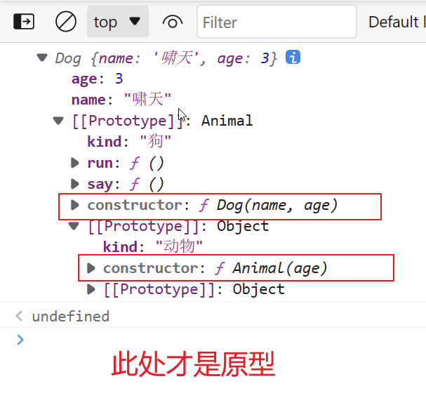

# JavaScript 基础篇

## JavaScript 的数据类型有哪些？

纯记忆题，答案有 8 种。

string、number、boolean、undefined、null、bigint、symbol、Object。

## 深拷贝和浅拷贝的区别

1. 浅拷贝拷贝一个对象，只会拷贝当前对象第一层属性，如果属性的值是引用类型，只会拷贝引用的地址。
2. 深拷贝拷贝一个对象，会递归的拷贝当前对象和它的所有属性中的引用类型，保持新旧对象完全独立，没有相互引用。

## instanceof 的优缺点

作用：

- 判断某个对象是否为某个类或构造函数的实例。

缺点：

- 无法跨窗口（Cross-Window）或跨框架（Cross-Frame）检查（只能判断当前全局作用域下的对象，无法判断从外部传入的对象）。
- 无法判断基本类型数据。
- 可能会检测到继承的类型
- 无法检查自定义类的实例：`instanceof` 运算符无法判断自定义的类。

## 原型链是什么？

**概念题**，答题思路为大概念转化为小概念（分割），抽象化具体（举例）。

### 答题思路

原型链涉及到的概念挺多的，**首先说说原型，我先举个例子吧**。

假设我们有一个**普通对象** `const x = {}` ，这个 `x` 会有一个隐藏属性，叫 `__proto__`（现在叫 `[[Prototype]]`），这个属性会指向 `Object.prototype` ，即：

```js
x.__proto__ === Object.prototype
```

此时，我们说 `x` 的原型是 `Object.prototype` ，或者说 `Object.prototype` 是 `x` 的原型。

而这个 `__proto__` 属性的唯一作用就是用来指向 `x` 的原型。

如果没有 `__proto__` 属性，`x` 就不知道原型是谁了。

**接下来说说原型链，我还是举例说明吧**。

假设我们有一个数组对象 `const a = []` ，这个 `a` 也会有一个隐藏属性，叫做 `__proto__` ，这个属性会指向 `Array.prototype` ，即

```js
a.__proto__ === Array.prototype
```

此时，我们说 `a` 的原型是 `Array.prototype`，跟上面的 `x` 一样。但又有一点不一样，那就是 `Array.prototype` 也有一个隐藏属性 `__proto__` ，指向 `Object.prototype`

```js
Array.prototype.__proto__ === Object.prototype
```

这样一来，a 就有两层原型

1. a 的原型是 `Array.prototype`
2. a 的原型的原型是 `Object.prototype`

于是就通过隐藏属性 `__proto__` 形成了一个链条：

```js
a ===> Array.prototype ===> Object.prototype
```

这就是原型链。

**怎么做：**（如何添加/修改原型链）

不标准的写法（改写 x 的隐藏属性 `__proto__` ）

```jsx
x.__proto__ = 原型
```

标准写法（推荐）

```jsx
const a = Object.create(原型)
const b = new 构造函数() // 会导致 x.__???__ === 构造函数.prototype
```

**解决了什么问题：**

在没有 Class 的情况下实现「继承」。以 `a ===> Array.prototype ===> Object.prototype` 为例，我们说

1. a 是 Array 的实例，a 拥有 `Array.prototype` 里的属性
2. Array 构造函数继承了 Object 构造函数（注意专业术语的使用）
3. a 是 Object 的间接实例，a 拥有 `Object.prototype` 里的属性
4. 这样一来，a 就既拥有了 `Array.prototype` 里的属性，又拥有了 `Object.prototype` 里的属性

**优点：**

简单、优雅。

**缺点：**

跟 Class 相比，不支持私有属性。

**怎么解决缺点：**

使用 class 呗。但 class 是 ES6 引入的，不被旧 IE 浏览器支持。

> 建议熟读这篇文章

[JS 中 **proto** 和 prototype 存在的意义是什么？](https://www.zhihu.com/question/56770432/answer/315342130)

## 这段代码中的 this 是多少？

把判断依据背下来才能全对

```jsx
var length = 4;
function callback() {
  console.log(this.length) // => 打印出什么？
}
const obj = {
  length: 5,
  method(callback) {
    callback()
  }
}
obj.method(callback, 1, 2)
```

> 建议熟读这篇文章

[this 的值到底是什么？一次说清楚](https://zhuanlan.zhihu.com/p/23804247)

## JavaScript 的 new 做了什么

记忆题，建议写博客，甩链接

1. 创建临时对象/新对象
2. 绑定原型
3. 指定 this = 临时对象
4. 执行构造函数
5. 返回临时对象

> 建议熟读这篇文章

[JS 的 new 到底是干什么的？](https://zhuanlan.zhihu.com/p/23987456)

## 什么是立即执行函数

概念题，「是什么、怎么做、解决了什么问题、优点、缺点、怎么解决缺点」

**是什么：**

声明一个匿名函数，并立即调用它，就是立即执行函数。

**怎么做：**

```js
(function(){ console.log('我是匿名函数') }());
(function(){ console.log('我是匿名函数') })();
!function(){ console.log('我是匿名函数') }();
+function(){ console.log('我是匿名函数') }();
-function(){ console.log('我是匿名函数') }();
~function(){ console.log('我是匿名函数') }();
void function(){ console.log('我是匿名函数') }();
new function(){ console.log('我是匿名函数') }();
var a = function(){ console.log('我是匿名函数') }();
```

上面的每一行代码都是一个立即执行函数。（举例）

**解决了什么问题：**

在 ES6 之前，只能通过它来「创建局部作用域」。

**优点：**

兼容性好。

**缺点：**

丑，为什么这么丑？看视频。

**怎么解决缺点：**

使用 ES6 的 block + let 语法：

```js
{
  let a = '我是局部变量'
  console.log(a) // '我是局部变量'
}
console.log(a) // undefined
```

## 什么是闭包？怎么用？

概念题，「是什么、怎么做、解决了什么问题、优点是、缺点是、怎么解决缺点」

**是什么**

闭包是 JS 的一种**语法特性**（不能说 JS 的所有函数都是闭包，应该说 JS 的函数都支持闭包）

> 闭包 = 函数 + 自有变量（局部变量）

对于一个函数来说，变量分为：全局变量、局部变量、自有变量（局部变量）

**怎么做**

```js
let count = 0
function add (){ // 访问了外部变量的函数
  count += 1
}
```

把上面代码放在「非全局环境」里，就是闭包。

> 注意，闭包不是 count，闭包也不是 add，闭包是 count + add 组成的整体。

怎么制造一个「非全局环境」呢？答案是立即执行函数

```js
(function (){
  let count = 0
  function add (){ // 访问了外部变量的函数
    count += 1
  }
})()
```

但是上面的代码没有任何实际功能，所以需要添加一个 `return` add 函数的立即执行函数

```js
const add = function() {
  let count = 0
  return () => {
    count += 1
  }
}()

add() // => count += 1
```

至此，我们就实现了一个完整的「闭包的应用」。

例2：实现一个玩家生命条数加减的功能

```js
const die = function () {
  let lives = 3
  return () => {
    lives -= 1
  }
}()

die() // => lives -= 1
```

> 注意：闭包 ≠ 闭包的应用，但面试官问你「闭包」的时候，你一定要答上面「闭包 的应用」（就是在面试时把闭包 = 闭包的应用）

**解决了什么问题：**

1. 避免全局变量被污染
2. 提供对局部变量的间接访问（只能通过函数操作局部变量）
3. 维持变量，使其不被垃圾回收

优点：

简单，易用

缺点：

闭包**使用不当**容易造成内存泄漏

如何解决缺点：

尽量少用，或者使用后消除引用

> 关于闭包更详细的解释，建议熟读这篇文章：

[「每日一题」JS 中的闭包是什么？](https://zhuanlan.zhihu.com/p/22486908)

## 关于内存泄漏

「闭包造成内存泄露」这句话指的是曾经旧版本 IE 的 bug 导致的问题，居然被传成这样了。

参考这篇文章：

[js闭包测试 - 司徒正美 - 博客园](https://www.cnblogs.com/rubylouvre/p/3345294.html)

## **如何实现类**

方法一：使用原型

```js
// 实现一个狗的类
function Dog(name, age) {
  this.name = name
  this.age = age
}

Dog.prototype.kind = '狗'
Dog.prototype.say = function() {
  console.log(`汪汪汪！我是${this.name}`)
}
Dog.prototype.run = function() {
  console.log('我会跑')
}

// 使用
const dog1 = new Dog('啸天', 3)
dog1.say()
```

方法二：使用 class

```js
// 使用 class 实现，属性 kind 放在哪都无法实现上面的一样的效果
class Dog {
  constructor(name, age) {
    this.name = name
    this.age = age
  }
  say() {
    console.log(`汪汪汪！我是${this.name}`)
  }
  run() {
    console.log('我会跑')
  }
}

// 使用
const dog1 = new Dog('啸天', 3)
dog1.say()
```

## 如何实现继承？

方法一：使用原型链

```js
function Animal(age) {
  this.age = age
}
Animal.prototype.kind = '动物'

function Dog(name, age) {
  Animal.call(this, age)
  this.name = name
  this.age = age
}

Dog.prototype.__proto__ = Animal.prototype // 原型继承（但此代码不合法）

Dog.prototype.kind = '狗'
Dog.prototype.say = function() {
  console.log(`汪汪汪！我是${this.name}`)
}
Dog.prototype.run = function() {
  console.log('我会跑')
}

const dog1 = new Dog('啸天', 3)
console.log(dog1)
```

由于上面的 `Dog.prototype.__proto__ = Animal.prototype` 并不符合规范（继承由各个浏览器内部实现，不同浏览器继承的属性名称可能不同），可以用以下兼容代码替换

```js
const Empty = function(){}
Empty.prototype = Animal.prototype
Dog.prototype = new Empty()
Dog.prototype.constructor = Dog // 上面三行代码会覆盖默认 constructor 需要重新添加
```

这样做的好处是：

- 通过 new Empty 间接继承了 Animal 的 prototype
- 并且在继承时不会运行 Animal 函数本身的代码

在控制台打印上面的对象



方法二：使用 class 实现继承

```js
class Animal {
  constructor(age) {
    this.age = age
  }
}

class Dog extends Animal {
  constructor(name, age) {
    super(age)
    this.name = name
    this.age = age
  }
  say() {
    console.log(`汪汪汪！我是${this.name}`)
  },
  run() {
    console.log('我会跑')
  }
}

// 使用
const dog1 = new Dog('啸天', 3)
dog1.say()
```

方法三：使用 Object.create 实现继承

```js
function Parent(name) {
  this.name = name
}
function Child(name, age) {
  Parent.call(this, name);
  this.age = age
}

Child.prototype = Object.create(Parent.prototype, {
  constructor: Child
})
```

