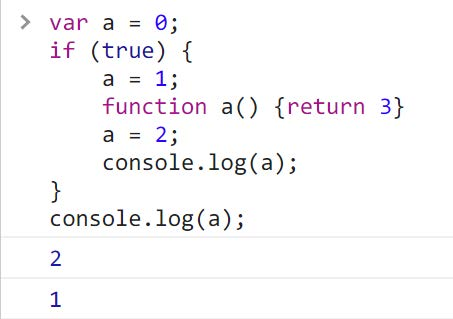
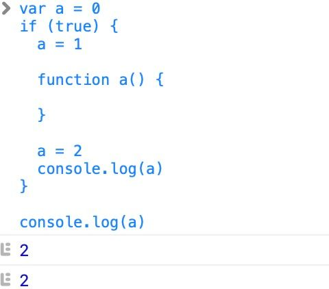
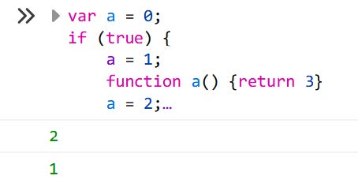

# 刁钻题

## [1,2,3].map(parseInt)

运行

```js
[1,2,3].map(parseInt)
// 展开
parseInt(1, 0, arr) => parseInt(1) => 1
parseInt(2, 1, arr) => NaN
parseInt(3, 2, arr) => NaN
```

正确写法

```js
[1,2,3].map((number) => parseInt(number))
```

## a.x = a = {}

运行

```js
var a = {x: #505}; // 地址 #404
var b = a; // b = #404
a.x = a = {x: 2}; // #505
// #404.x = a = #505
// #404.x = #505
// b.x = {x: 2}
console.log(a.x) // 2
console.log(b.x) // 1
// 答案自己在浏览器运行
```

## if true / function a / a = 2

运行

```js
var a = 0;
if (true) {
  a = 1;
  function a() { return 3 }
  a = 2;
  console.log(a); // 2
}
console.log(a); // 1
```

这题属于未定义行为（见 [developer.mozilla.org](https://developer.mozilla.org/zh-CN/docs/Web/JavaScript/Reference/Statements/function#有条件的创建函数)），实在刁钻，答案并不唯一。但你可以回答「打印 2 和 1」。

### Chrome / Edge 运行结果



### Safari 运行结果：



### Firefox 运行结果：



## LazyMan

```js
实现 LazyMan，能按以下方式调用：

> LazyMan("Hank")

你好，我是 Hank

> LazyMan("Hank").sleep(10)

 .eat("lunch")

你好，我是 Hank

（沉默十秒）

我醒了，我刚睡了 10 秒

吃午餐
```