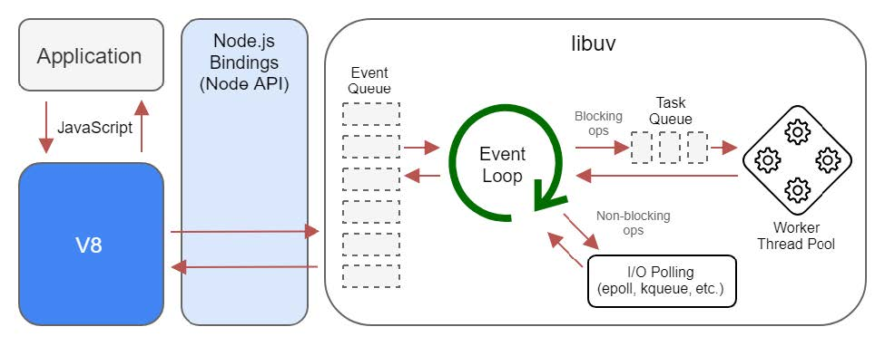

<!-- ---
title: Node.js 技术架构
date: 2021-07-17T16:46:12+08:00
tags:
  - Node.js
--- -->

# Node.js 技术架构

## API 文档

- 官方地址：[中文文档](http://nodejs.cn/api/)/[英文文档](https://nodejs.org/api/)
- [devdocs.io](https://devdocs.io/) 搜索功能便捷，支持夜间模式，并且可以离线观看

## Node.js 是什么

- **是一个平台**
  - 让多种技术组合起来
  - 让 JavaScript 也能调用系统接口、开发后端应用

- **Node.js 用到了哪些技术**
  - V8引擎
  - libuv
  - C/C++ 实现的 c-ares、http-parser、OpenSSL、zlib 等库

## Node.js 不是什么

- **不是 web 框架**
  - Node.js 并不是 web 后端框架
  - 所以你不能把 Node.js 与 Flask 或 Spring 对比

- **不是编程语言**
  - Node.js 并不是后端的 JS
  - 所以你不能把 Node.js 与 Python 或 PHP 对比

## Node.js 技术架构

<NodejsTechnologyArchitecture />


随着 Node.js 的版本已经从 0.8 升级到 12.11.1，其架构也在一直变化中。如果你想看源码，推荐看 [Node.js v0.10.0](https://github.com/nodejs/node/tree/v0.10.0) 版本，因为这个版本使用了很久，而且源码相对最新版较少。

如果想要了解更多，可以看 [深入理解Node.js：核心思想与源码分析](https://github.com/yjhjstz/deep-into-node)

## 什么是 bindings

### 背景

- C/C++ 实现了一个 http_parser 库， 很高效
- 你只会写 JS，但想使用这个库
- 直接调用肯定不会成功，于是就需要一个中间的桥梁

### bindings

- Node.js 用 C++ 对 `http_parser` 进行封装，使它符合某些要求，封装的文件名就叫做 `http_parser_bindings.cpp`
- 用 Node.js 提供的编译工具将其编译为 `.node` 文件，JS 代码就可以直接 require 这个 `.node` 文件
- 这样 JS 就能调用 C++ 库，中间的桥梁就是 binding
- 由于 Node.js 提供了很多 binding，所以要加个 s，这就是 **`bindings`** 的由来

## JS 与 C++ 交互案例

- JS 调用 C++ 代码：[官方示例](http://nodejs.cn/api/addons.html#addons_function_arguments)
- C++ 调用 JS 代码：[官方示例](http://nodejs.cn/api/addons.html#addons_callbacks)


## 什么是 EventLoop

**Event 表示事件**，如：
- 计时器到期，要执行一个事件
- 文件读取完毕或出错，要执行一个事件
- socket 有内容了，关闭了，要执行一个事件

**Loop 就是循环**，如：
- while(true) 循环（死循环）
- Node.js 需要按照顺序轮询每种事件，这种事件往往都是循环，所以叫 loop

**EventLoop**
- 操作系统触发事件，JS 处理事件，EventLoop 就是对事件处理顺序的管理
- 通常 EventLoop 会停留在 poll 阶段，不停的问操作系统，接下来有没有事情做

EventLoop 执行顺序图示

```
   ┌───────────────────────────┐
┌─>│           timers          │
│  └─────────────┬─────────────┘
│  ┌─────────────┴─────────────┐
│  │     pending callbacks     │
│  └─────────────┬─────────────┘
│  ┌─────────────┴─────────────┐
│  │       idle, prepare       │
│  └─────────────┬─────────────┘      ┌───────────────┐
│  ┌─────────────┴─────────────┐      │   incoming:   │
│  │           poll            │<─────┤  connections, │
│  └─────────────┬─────────────┘      │   data, etc.  │
│  ┌─────────────┴─────────────┐      └───────────────┘
│  │           check           │
│  └─────────────┬─────────────┘
│  ┌─────────────┴─────────────┐
└──┤      close callbacks      │
   └───────────────────────────┘
```

::: details 图示


:::

## Node.js 工作流程



## setTimeout & setImmediate 的执行顺序

下面的代码中，那个函数先执行

```js
setTimeout(f1, 0)
setImmediate(f2)
```

一般情况下都是 `setImmediate(f2)` 先执行，因为它处在 check 阶段，只有在 Node.js 第一次运行时，会先进入 timers 阶段

end 。。。

<script lang="ts" setup>
import NodejsTechnologyArchitecture from '../_components/NodejsTechnologyArchitecture.vue'
</script>