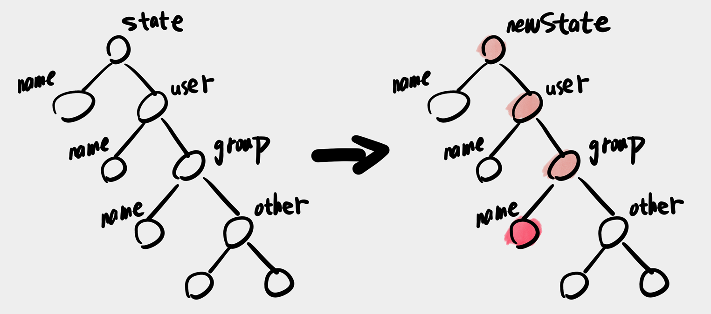

# React 状态管理

什么是数据更新？

在 React 中，数据更新就是 state 改变。

## 如何判断 state 是否改变

**class 组件：**

- 当调用 `this.setState(this.state)`时，不管 state 是否改变，都会调用 render。
- 但 class 组件容易造成多余的 render，即便你什么都不做，直接调用 `this.setState` 还是会 render
- class 可以在 should 中对比新旧 state，控制是否重新 render，[demo](https://codesandbox.io/s/class-zujian-should-smmny?file=/src/index.js)
- React 还提供了 pureComponents，自动帮你做对比，[demo](https://codesandbox.io/s/class-pure-zujian-2o5m0?file=/src/index.js)
- 但上面的优化有个缺点，如果你修改原始的 state 并传入 `this.setState`，它们就会失效，[demo](https://codesandbox.io/s/class-zujianxiugai-stategai-render-mei-render-mqg1m)，也就是会导致无法 render。
- 所以，永远不要直接修改 state。

**函数组件：**

- 当使用 `setState(state)` 时，只有 state 的引用改变，才会重新 render。
- 可以强迫你每次 `setState` 都使用新的 state。

## 如何更新 state

在函数组件中，我们通常会使用 `newState = { ...state, count: 2 }` 的方式修改 state。

但，如果 state 的嵌套层级变多了怎么办，比如我要修改 `state.user.group.name`，就要这么写：

```js
newState = {
  ...state,
  user: {
    ...state.user,
    group: {
      ...state.user.group,
      name: 'group 2'
    }
  }
}
```

这样会让更新 state 变得特别复杂，有什么办法可以让创建 state 简化？

可以使用 immer.js，代码如下

```js
const newState = produce(data, (draft) => {
  draft.user.group.name = "group 2"
})
```

只写了一行代码，就可以创建新的 state。它是怎么做到的？

在上面代码中的 draft，其实是一个 Proxy，会把你的修改收集起来，然后创建一个新对象。

而且 immer 创建新对象的方式很智能，并不是直接深拷贝（深拷贝很浪费内存），它的更新方式如下：



总结

- immer.js 永远不会修改原数据
- 两个图中的 other 是同一个对象，只有在你修改 other 时才创建新的对象。


## 实现撤销/恢复功能

假如要在本地实现一个撤销/恢复的功能，可以用以下思路：

- 创建 history、redo 两个数组
- 每次变更都会运行 `history.push()` 更新历史。
- 每次撤回在 `history.pop()` 的同时，使用 `redo.push()` 记录当前的撤回，以便恢复。
- 如果撤销后想要恢复，就使用 `redo.pop()` 拿到要恢复的值。
- 这就是 React 的 time travel（时间旅行）。