# Diff 算法

## 简单 Diff 算法

当新旧 vnode 的子节点都是一组节点时，为了以最小的性能开销完成更新操作，需要比较两组子节点，用于比较的算法就叫作 Diff 算法

例如有如下两个新旧节点

```js
// 旧 vnode
const oldVNode = {
  type: 'div',
  children: [
    { type: 'p', children: '1' },
    { type: 'p', children: '2' },
    { type: 'p', children: '3' }
  ]
}

// 新 vnode
const newVNode = {
  type: 'div',
  children: [
    { type: 'p', children: '4' },
    { type: 'p', children: '5' },
    { type: 'p', children: '6' }
  ]
}
```

上面两个节点在更新时只会更新文本内容，所以只需要对它们的文本内容经行更新，不需要销毁 DOM 重新挂载。按照这个思路，可以重新实现两组子节点更新逻辑

```js
function patchChildren(n1, n2, container) {
  if (typeof n2.children === 'string') {
    // ...
  } else if (Array.isArray(n2.children)) {
    const oldChildren = n1.children
    const newChildren = n2.children
    for (let i = 0; i < oldChildren.length; i++) {
      // 调用 patch 更新子节点
      patch(oldChildren[i], newChildren[i])
    }
  } else {
    // ...
  }
}
```

当然上面代码是假设新旧子节点数量相同的情况，我们还需要考虑新节点新增或删除的情况

```js
function patchChildren(n1, n2, container) {
  if (typeof n2.children === 'string') {
    // ...
  } else if (Array.isArray(n2.children)) {
    const oldChildren = n1.children
    const newChildren = n2.children
    const oldLen = oldChildren.length
    const newLen = newChildren.length
    const commonLength = Math.min(oldLen, newLen)
    for (let i = 0; i < commonLength; i++) {
      patch(oldChildren[i], newChildren[i], container)
    }
    // newLen > oldLen，说明有新子节点需要挂载
    if (newLen > oldLen) {
      for (let i = commonLength; i < newLen; i++) {
        patch(null, newChildren[i], container)
      }
    } else if (oldLen > newLen) {
      // oldLen > newLen，说明有旧子节点需要卸载
      for (let i = commonLength; i < oldLen; i++) {
        unmount(oldChildren[i])
      }
    }
  } else {
    // ...
  }
}
```

### DOM 复用与 key 的作用

之前的代码，我们减少了 DOM 操作的次数，提升了性能，但这种方式仍存在可优化空间，假设新旧节点如下

```js
// oldChildren
[
  { type: 'p' },
  { type: 'div' },
  { type: 'span' }
]

// newChildren
[
  { type: 'span' },
  { type: 'p' },
  { type: 'div' }
]
```

上面的代码只是顺序不同，节点元素并没有变更，这时，我们就需要引入额外的 key 来作为 vnode 的标识

```js
// oldChildren
[
  { type: 'p', children: '1', key: 1 },
  { type: 'p', children: '2', key: 2 },
  { type: 'p', children: '3', key: 3 }
]

// newChildren
[
  { type: 'p', children: '3', key: 3 },
  { type: 'p', children: '1', key: 1 },
  { type: 'p', children: '2', key: 2 }
]
```

我们可以遍历新旧节点，进行对比，如果 key 相同，就只会移动节点，不会经行销毁重新挂载，实现如下

```js
function patchChildren(n1, n2, container) {
  if (typeof n2.children === 'string') {
    // ...
  } else if (Array.isArray(n2.children)) {
    const oldChildren = n1.children
    const newChildren = n2.children

    for (let i = 0; i < newChildren.length; i++) {
      const newVNode = newChildren[i]
      for (let j = 0; j < oldChildren.length; j++) {
        const oldVNode = oldChildren[j]
        // 如果找到了具有相同 key 值的两个节点，说明可以复用，但仍然需要调用 patch 函数更新
        if (newVNode.key === oldVNode.key) {
          patch(oldVNode, newVNode, container)
          break
        }
      }
    }
  } else {
    // ...
  }
}
```

### 找到需要移动的元素

上面的代码，只是找到了可以复用的节点，接下来需要思考的是，如何判断一个节点是否需要移动，以及如何移动。

先想一想在什么情况下节点不需要移动？答案很简单，当新旧两组子节点的节点顺序不变时，就不需要额外的移动操作：

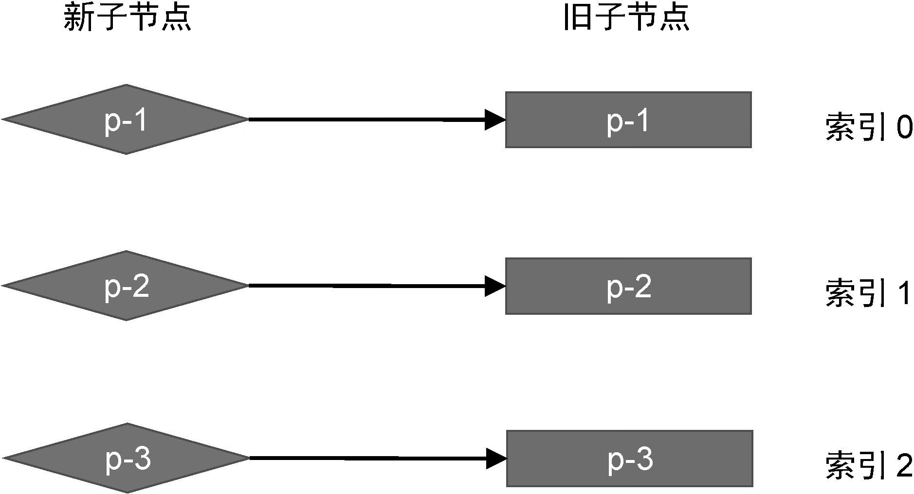

我们发现新旧两组子节点 key 对应的 DOM 元素索引值都是递归的

- key 值为 1 的节点在旧 children 数组中的索引为 0；
- key 值为 2 的节点在旧 children 数组中的索引为 1；
- key 值为 3 的节点在旧 children 数组中的索引为 2。

如果把这些位置索引值按照先后顺序排列，则可以得到一个序列：0、1、2。这是一个递增的序列，在这种情况下不需要移动任何节点。

我们再来看看另外一个例子，如图

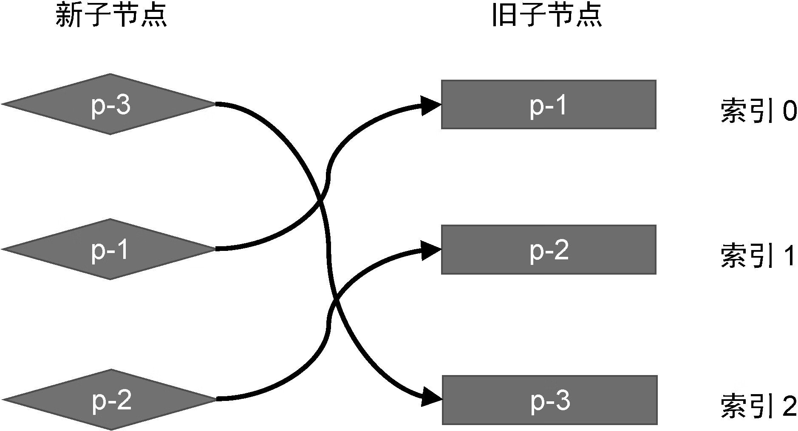

它们的规律如下

- p-3 在旧节点中的索引值为 2，新节点索引值为 0
- p-1 在旧节点中的索引值为 0，新节点索引值为 1
- p-2 在旧节点中的索引值为 1，新节点索引值为 2

根据上面的规律，在旧 children 中寻找具有相同 key 值节点的过程中，遇到的最大索引值。如果在后续寻找的过程中，存在索引值比当前遇到的最大索引值还要小的节点，则意味着该节点需要移动，也就是 p-3 > p-1，p-3 > p-2（即 2 > 0，2 > 1）的情况下，p-1 和 p-2 需要移动


最后找到需要移动的节点后，根据它上一个节点的前后 DOM 节点，插入需要移动的节点

```js
function patchChildren(n1, n2, container) {
  if (typeof n2.children === 'string') {
    // ...
  } else if (Array.isArray(n2.children)) {
    const oldChildren = n1.children
    const newChildren = n2.children

    let lastIndex = 0
    for (let i = 0; i < newChildren.length; i++) {
      const newVNode = newChildren[i]
      let j = 0
      for (j; j < oldChildren.length; j++) {
        const oldVNode = oldChildren[j]
        if (newVNode.key === oldVNode.key) {
          patch(oldVNode, newVNode, container)
          if (j < lastIndex) {
            // newVNode 的前一个 vnode，即 prevVNode
            const prevVNode = newChildren[i - 1]
            // 如果 prevVNode 不存在，则说明当前 newVNode 是第一个节点，它不需要移动
            if (prevVNode) {
              const anchor = prevVNode.el.nextSibling
              insert(newVNode.el, container, anchor)
            }
          } else {
            lastIndex = j
          }
          break
        }
      }
    }

  } else {
    // ...
  }
}

const renderer = createRenderer({
  // ...
  insert(el, parent, anchor = null) {
    parent.insertBefore(el, anchor)
  }
  // ...
})
```

### 添加新的节点

有些时候，我们需要添加新的节点，如下：

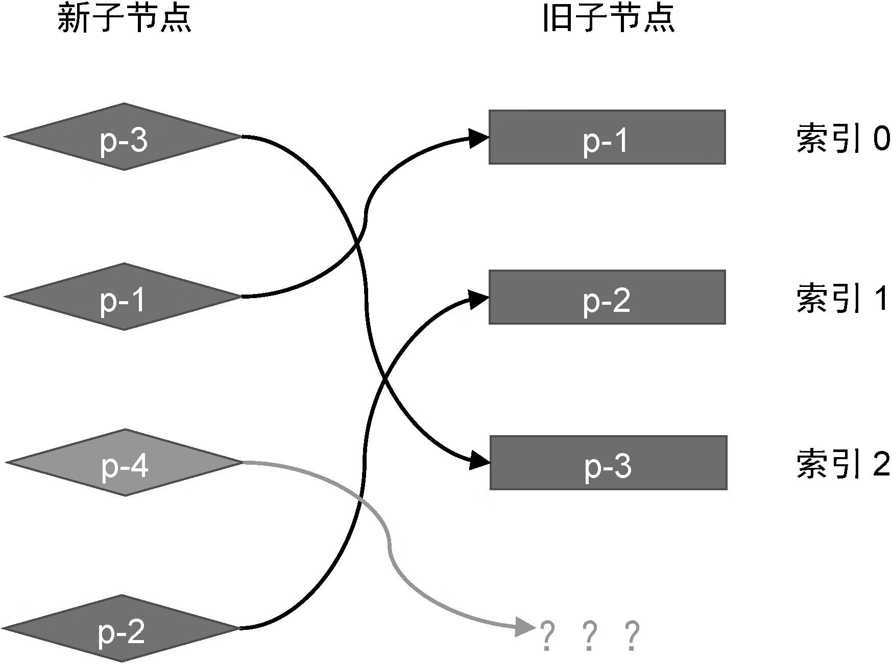

如果在旧子节点列表中找不到该节点，说明该节点为新增的节点，实现如下

```js
function patchChildren(oldNode, newNode, container) {
  if (typeof newNode.children === 'string') {
    // ...
  } else if (Array.isArray(newNode.children)) {
    const oldChildren = oldNode.children
    const newChildren = newNode.children

    let lastIndex = 0
    for (let i = 0; i < newChildren.length; i++) {
      const newVNode = newChildren[i]
      let j = 0
      // 在第一层循环中定义变量 find，代表是否在旧的一组子节点中找到可复用的节点，
      // 初始值为 false，代表没找到
      let find = false
      for (j; j < oldChildren.length; j++) {
        const oldVNode = oldChildren[j]
        if (newVNode.key === oldVNode.key) {
          // 一旦找到可复用的节点，则将变量 find 的值设为 true
          find = true
          patch(oldVNode, newVNode, container)
          if (j < lastIndex) {
            const prevVNode = newChildren[i - 1]
            if (prevVNode) {
              const anchor = prevVNode.el.nextSibling
              insert(newVNode.el, container, anchor)
            }
          } else {
            lastIndex = j
          }
          break
        }
      }
      // 当前 newVNode 是新增节点，需要挂载
      if (!find) {
        // 获取当前 newVNode 的前一个 vnode 节点
        const prevVNode = newChildren[i - 1]
        let anchor = null
        if (prevVNode) {
          // 如果有前一个 vnode 节点，则使用它的下一个兄弟节点作为锚点元素
          anchor = prevVNode.el.nextSibling
        } else {
          // 如果没有前一个 vnode 节点，使用容器元素的 firstChild 作为锚点
          anchor = container.firstChild
        }
        patch(null, newVNode, container, anchor)
      }
    }

  } else {
    // ...
  }
}

// patch 函数需要接收第四个参数，即锚点元素
function patch(oldNode, newNode, container, anchor) {
  // ...

  if (typeof type === 'string') {
    if (!oldNode) {
      mountElement(newNode, container, anchor)
    } else {
      patchElement(oldNode, newNode)
    }
  } else if (type === Text) {
    // ...
  } else if (type === Fragment) {
    // ...
  }
}

// mountElement 函数需要增加第三个参数，即锚点元素
function mountElement(vnode, container, anchor) {
  // ...

  insert(el, container, anchor)
}
```

### 移除不存在的旧节点

有时候还需要移除不存在的旧节点，如下

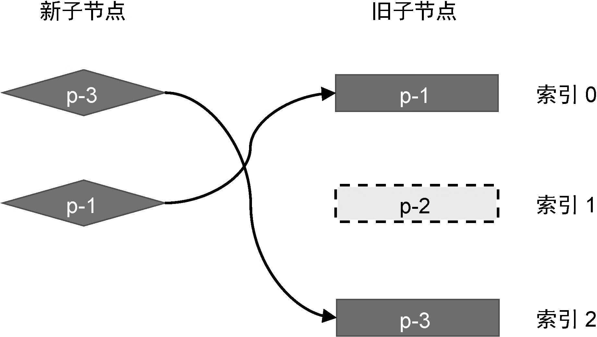

只要在之前的处理遍历完成后，再次遍历旧节点，看它在新节点中有没有对应节点即可

```js
function patchChildren(n1, n2, container) {
  if (typeof n2.children === 'string') {
    // ...
  } else if (Array.isArray(n2.children)) {
    const oldChildren = n1.children
    const newChildren = n2.children

    let lastIndex = 0
    for (let i = 0; i < newChildren.length; i++) {
      // ...
    }

    // 遍历旧的一组子节点
    for (let i = 0; i < oldChildren.length; i++) {
      const oldVNode = oldChildren[i]
      const has = newChildren.find(
        vnode => vnode.key === oldVNode.key
      )
      if (!has) {
        unmount(oldVNode)
      }
    }
  } else {
    // ...
  }
}
```

## 双端 Diff 算法

简单 Diff 算法的问题在于，它对 DOM 的移动操作并不是最优的。拿上一章的例子来看，如图


在这个例子中，如果使用简单 Diff 算法来更新它，则会发生两次 DOM 移动操作，如图

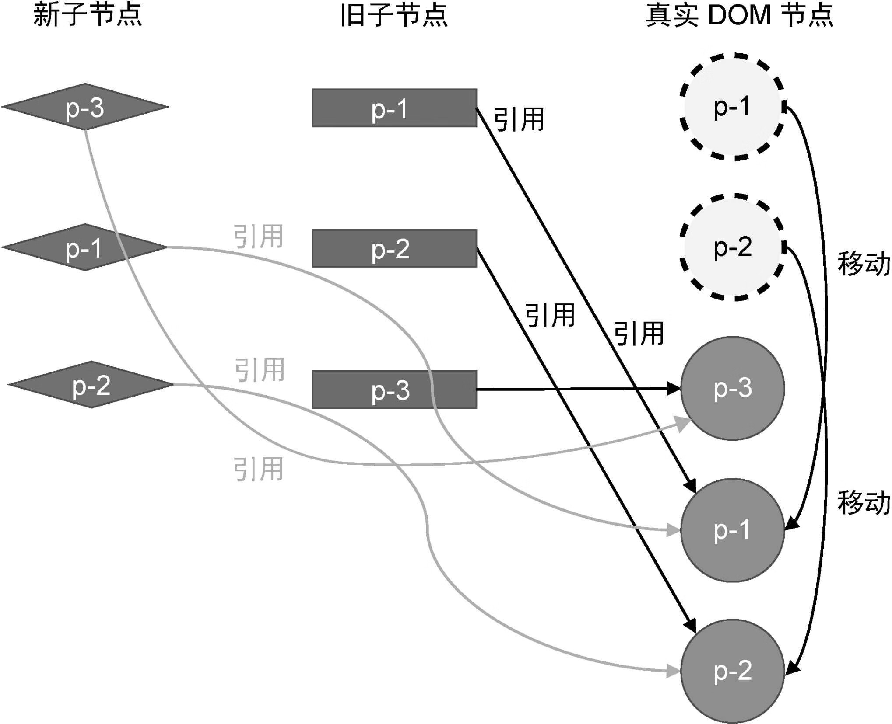

然而，上述更新过程并非最优解。在这个例子中，其实只需要通过一步 DOM 节点的移动操作即可完成更新，即只需要把真实 DOM 节点 p-3 移动到真实 DOM 节点 p-1 前面

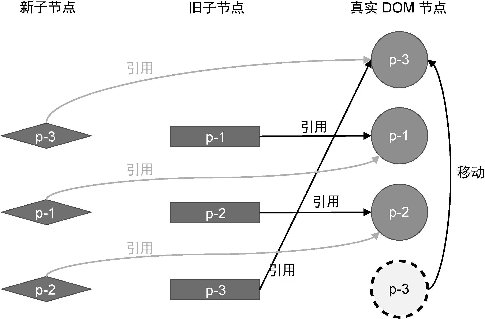

可以看到，理论上只需要一次 DOM 移动操作即可完成更新。但简单 Diff 算法做不到这一点，不过本章我们要介绍的双端 Diff 算法可以做到。接下来，我们就来讨论双端 Diff 算法的原理。

顾名思义，双端 Diff 算法是一种同时对新旧两组子节点的两个端点进行比较的算法。因此，我们需要四个索引值，分别指向新旧两组子节点的端点

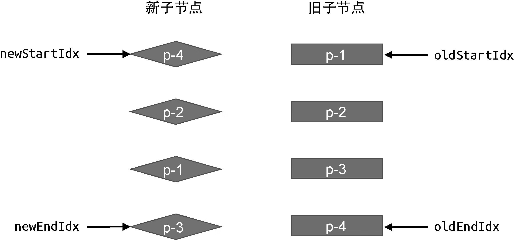

用代码来表达四个端点，如下面 patchChildren 和 patchKeyedChildren 函数的代码所示

```js
function patchChildren(n1, n2, container) {
  if (typeof n2.children === 'string') {
    // ...
  } else if (Array.isArray(n2.children)) {
    // 封装 patchKeyedChildren
    patchKeyedChildren(n1, n2, container)
  } else {
    // ...
  }
}

function patchKeyedChildren(n1, n2, container) {
  const oldChildren = n1.children
  const newChildren = n2.children
  // 四个索引值
  let oldStartIdx = 0
  let oldEndIdx = oldChildren.length - 1
  let newStartIdx = 0
  let newEndIdx = newChildren.length - 1
  // 四个索引指向的 vnode 节点
  let oldStartVNode = oldChildren[oldStartIdx]
  let oldEndVNode = oldChildren[oldEndIdx]
  let newStartVNode = newChildren[newStartIdx]
  let newEndVNode = newChildren[newEndIdx]
}
```

其中 oldStartVNode 和 oldEndVNode 是旧子节点中的第一个节点和最后一个节点，newStartVNode 和 newEndVNode 则是新子节点的第一个节点和最后一个节点。有了这些信息之后，我们就可以开始进行双端比较了。怎么比较呢？如图

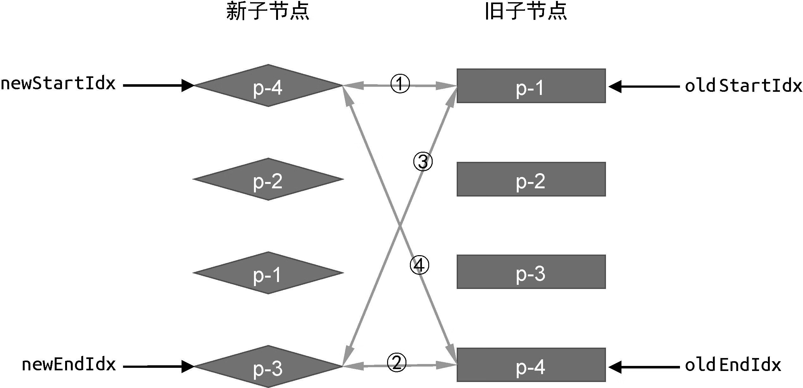

双端比较中，每一轮比较都分为四个步骤

- 第一步，头头对比：比较旧子节点中的第一个子节点 p-1 与新子节点中的第一个子节点 p-4，看它们是否相同。由于两者的 key 值不同，因此不相同，不可复用，于是什么都不做。
- 第二步，尾尾对比：比较旧子节点中的最后一个子节点 p-4 与新子节点中的最后一个子节点 p-3，看它们是否相同。由于两者的 key 值不同，因此不相同，不可复用，于是什么都不做。
- 第三步，旧尾新头：比较旧子节点中的第一个子节点 p-1 与新子节点中的最后一个子节点 p-3，看它们是否相同。由于两者的 key 值不同，因此不相同，不可复用，于是什么都不做
- 第四步，旧头新尾：比较旧子节点中的最后一个子节点 p-4 与新子节点中的第一个子节点 p-4。由于它们的 key 值相同，因此可以进行 DOM 复用。

此时，真实 DOM 节点顺序为 p-4、p-1、p-2、p-3，这与新的一组子节点顺序不一致。这是因为 Diff 算法还没有结束，还需要进行下一轮更新。因此，我们需要将更新逻辑封装到一个 while 循环中，如下面的代码所示

```js
// patchKeyedChildren 函数代码
while (oldStartIdx <= oldEndIdx && newStartIdx <= newEndIdx) {
  if (oldStartVNode.key === newStartVNode.key) {
    // 第一步
    patch(oldStartVNode, newStartVNode, container)
    oldStartVNode = oldChildren[++oldStartIdx]
    newStartVNode = newChildren[++newStartIdx]
  } else if (oldEndVNode.key === newEndVNode.key) {
    // 第二步
    patch(oldEndVNode, newEndVNode, container)
    oldEndVNode = oldChildren[--oldEndIdx]
    newEndVNode = newChildren[--newEndIdx]
  } else if (oldStartVNode.key === newEndVNode.key) {
    // 第三步
    patch(oldStartVNode, newEndVNode, container)
    insert(oldStartVNode.el, container, oldEndVNode.el.nextSibling)

    oldStartVNode = oldChildren[++oldStartIdx]
    newEndVNode = newChildren[--newEndIdx]
  } else if (oldEndVNode.key === newStartVNode.key) {
    // 第四步
    patch(oldEndVNode, newStartVNode, container)
    insert(oldEndVNode.el, container, oldStartVNode.el)

    oldEndVNode = oldChildren[--oldEndIdx]
    newStartVNode = newChildren[++newStartIdx]
  }
}
```

第二次循环代码

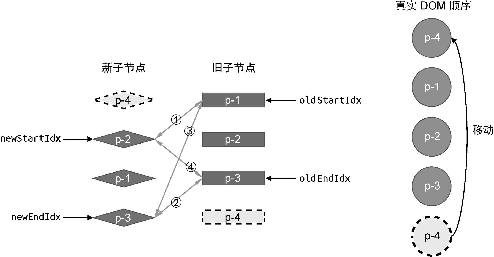


第三次循环代码

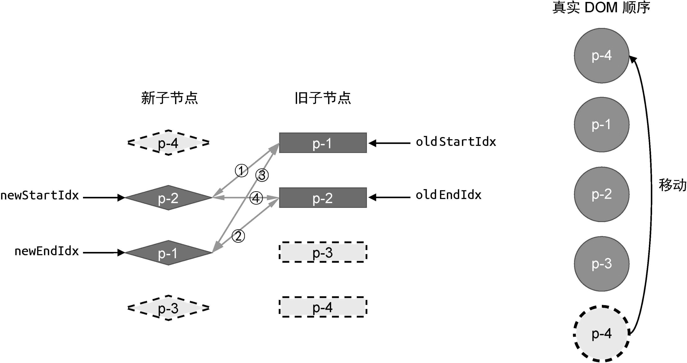

再次循环代码后，剩余节点如下

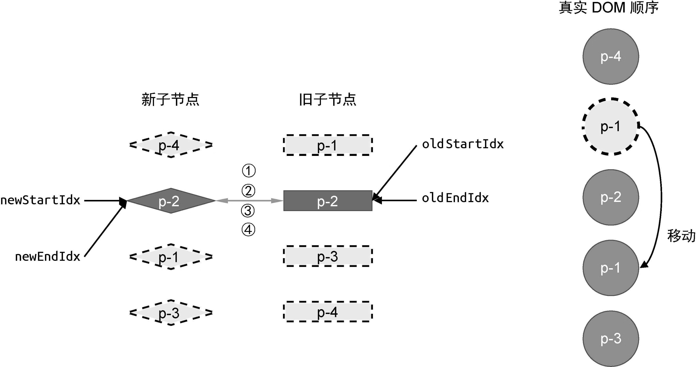

此时，DOM 顺序已经正确，再经行最后一轮对比，patch 即可

### 非理想状况的处理方式

我们用了一个比较理想的例子。我们知道，双端 Diff 算法的每一轮比较的过程都分为四个步骤。在上一节的例子中，每一轮比较都会命中四个步骤中的一个，这是非常理想的情况。但实际上，并非所有情况都这么理想，如图

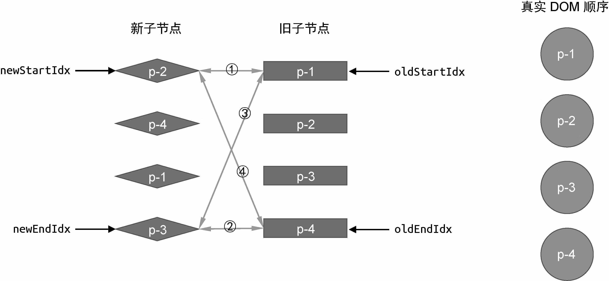

上面节点第一次查找时四个步骤都没有相同节点，此时我们可以，拿新节点第一个子节点去找旧节点中有没有对应节点，如果有，就把它移动到对应 DOM 中的位置

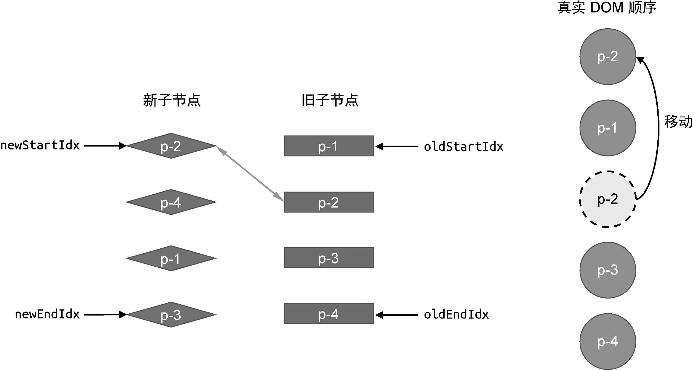

代码实现如下，注意：undefined 表示已经处理过了，直接跳过

```js
while (oldStartIdx <= oldEndIdx && newStartIdx <= newEndIdx) {
  // 如果为 undefined ，则说明该节点已经被处理过了，直接跳到下一个位置
  if (!oldStartVNode) {
    oldStartVNode = oldChildren[++oldStartIdx]
  } else if (!oldEndVNode) {
    oldEndVNode = oldChildren[--oldEndIdx]
  } else if (oldStartVNode.key === newStartVNode.key) {
    // ...
  } else if (oldEndVNode.key === newEndVNode.key) {
    // ...
  } else if (oldStartVNode.key === newEndVNode.key) {
    // ...
  } else if (oldEndVNode.key === newStartVNode.key) {
    // ...
  } else {
    const idxInOld = oldChildren.findIndex(
      node => node.key === newStartVNode.key
    )
    if (idxInOld > 0) {
      const vnodeToMove = oldChildren[idxInOld]
      patch(vnodeToMove, newStartVNode, container)
      insert(vnodeToMove.el, container, oldStartVNode.el)
      oldChildren[idxInOld] = undefined
      newStartVNode = newChildren[++newStartIdx]
    }

  }
}
```

此时继续处理剩下的节点，流程如下

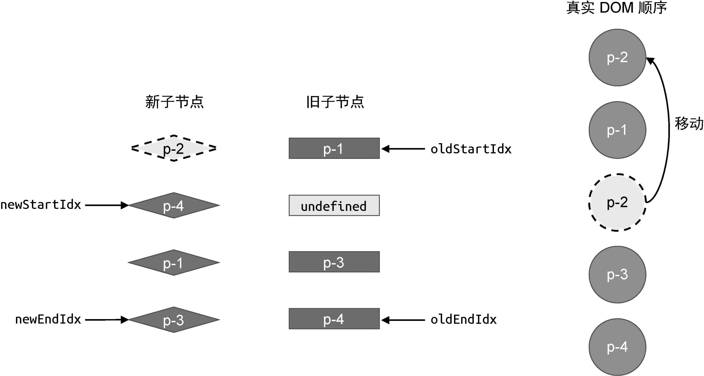

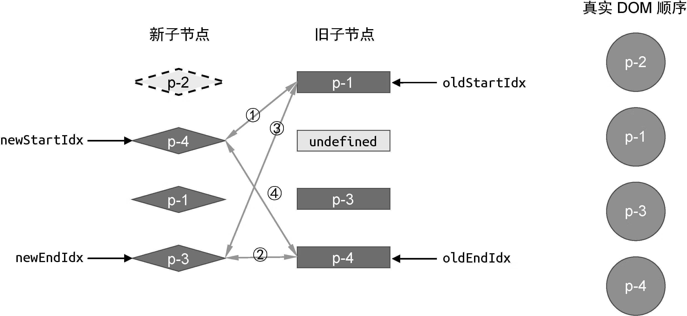

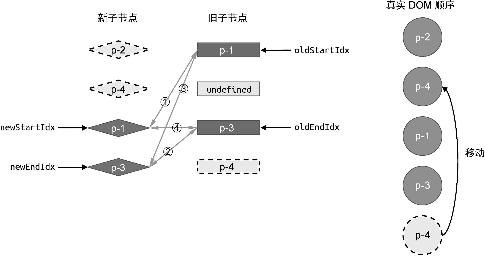


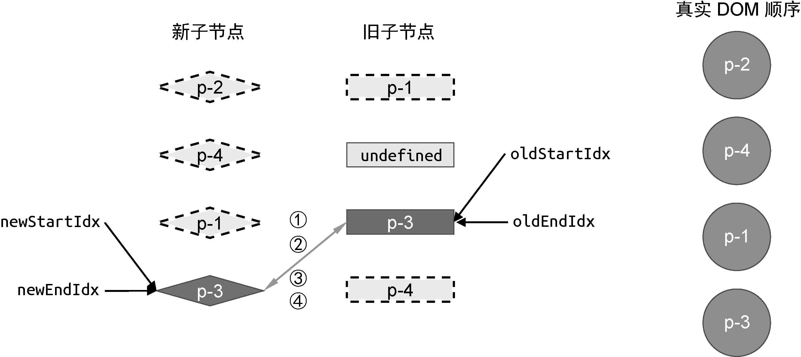

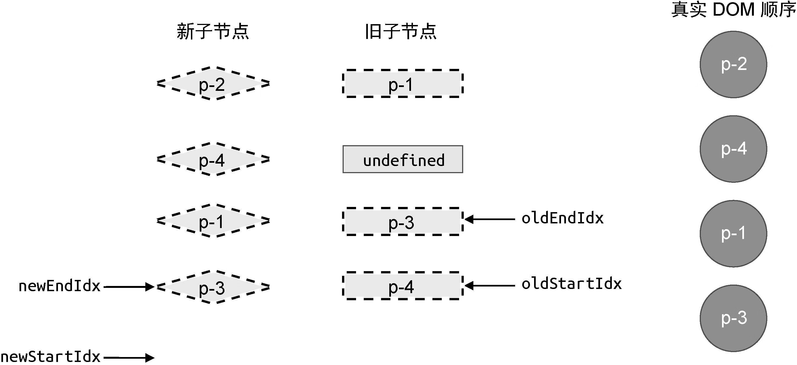

处理完成

### 挂载新节点

有时候会存在，新节点比旧节点多的情况，之前的代码并没有处理，例如以下新旧子节点，p4 不能在旧子节点列表中找到


处理方式也很简单，在旧的子节点列表中找不到该节点就直接挂载

```js{24-25}
while (oldStartIdx <= oldEndIdx && newStartIdx <= newEndIdx) {
  if (!oldStartVNode) {
    oldStartVNode = oldChildren[++oldStartIdx]
  } else if (!oldEndVNode) {
    oldEndVNode = newChildren[--oldEndIdx]
  } else if (oldStartVNode.key === newStartVNode.key) {
    // ...
  } else if (oldEndVNode.key === newEndVNode.key) {
    // ...
  } else if (oldStartVNode.key === newEndVNode.key) {
    // ...
  } else if (oldEndVNode.key === newStartVNode.key) {
    // ...
  } else {
    const idxInOld = oldChildren.findIndex(
      node => node.key === newStartVNode.key
    )
    if (idxInOld > 0) {
      const vnodeToMove = oldChildren[idxInOld]
      patch(vnodeToMove, newStartVNode, container)
      insert(vnodeToMove.el, container, oldStartVNode.el)
      oldChildren[idxInOld] = undefined
    } else {
      // 此处表示新节点在旧节点中未找到，需要挂载
      patch(null, newStartVNode, container, oldStartVNode.el)
    }
    newStartVNode = newChildren[++newStartIdx]
  }
}
```

当然上面的代码也并不完美，有时候可能循环条件结束了，还有未处理循环结束后处理新节点中的遗留节点，再来看另外一个例子

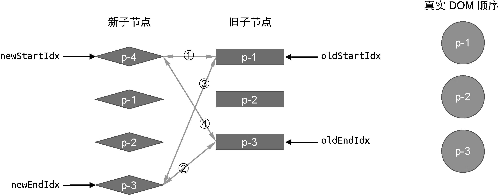

它们的循环流程如下

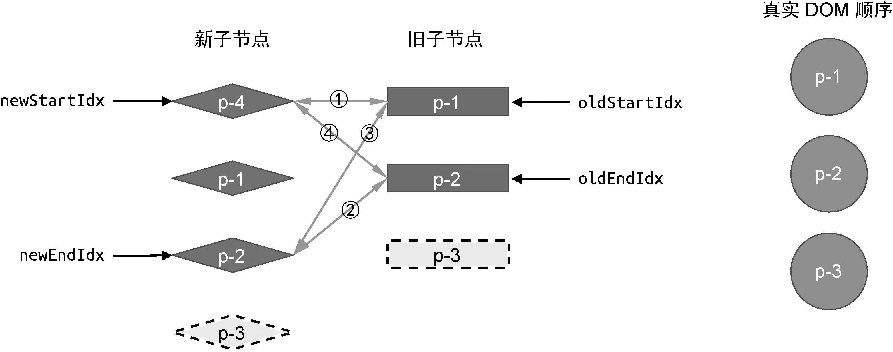
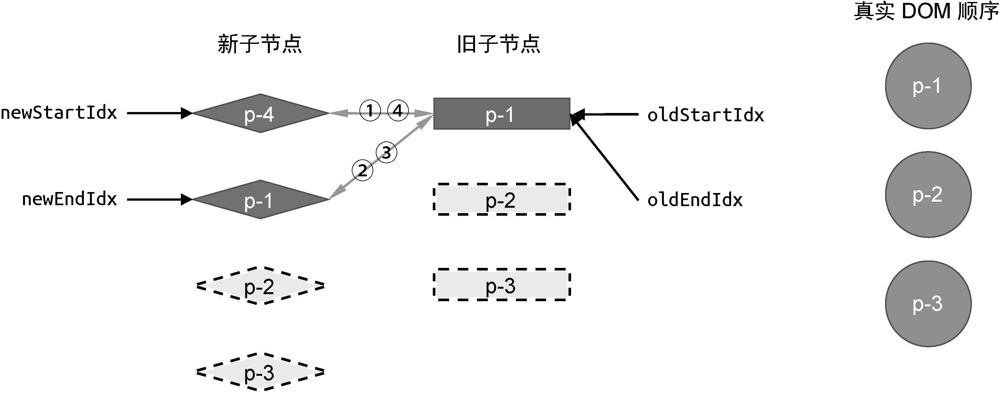
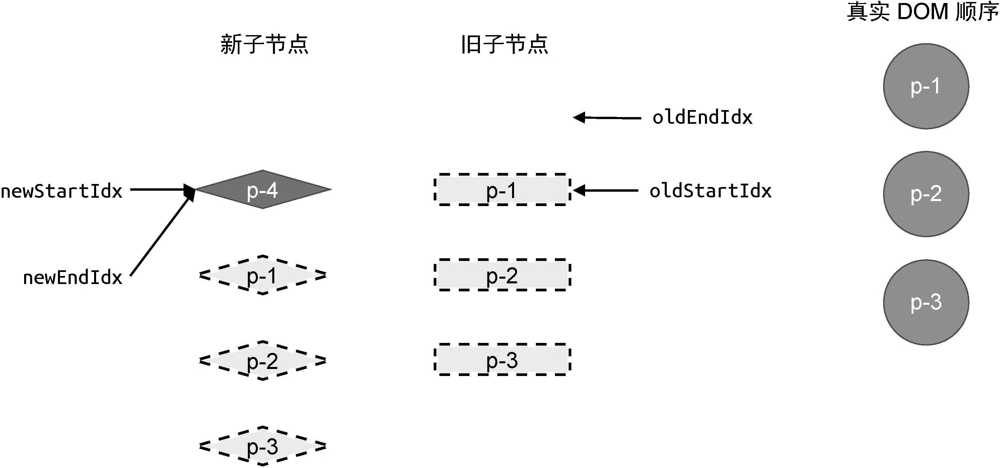

当最后一次循环结束后，还有一个新节点未处理，说明我们的条件并不完善，此时可以在循环之后，再添加一个条件，用于处理剩余新节点

```js
while (oldStartIdx <= oldEndIdx && newStartIdx <= newEndIdx) {
  // ...
}

if (oldEndIdx < oldStartIdx && newStartIdx <= newEndIdx) {
  // 如果满足条件，则说明有新的节点遗留，需要挂载它们
  for (let i = newStartIdx; i <= newEndIdx; i++) {
    patch(null, newChildren[i], container, oldStartVNode.el)
  }
}
```

### 移除不存在的元素

有时候新节点移除了部分旧节点，也需要特殊处理

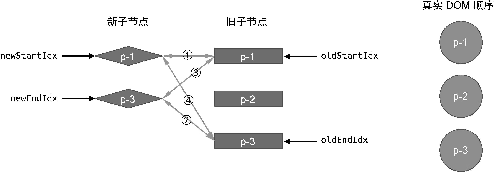

它的运行流程如下

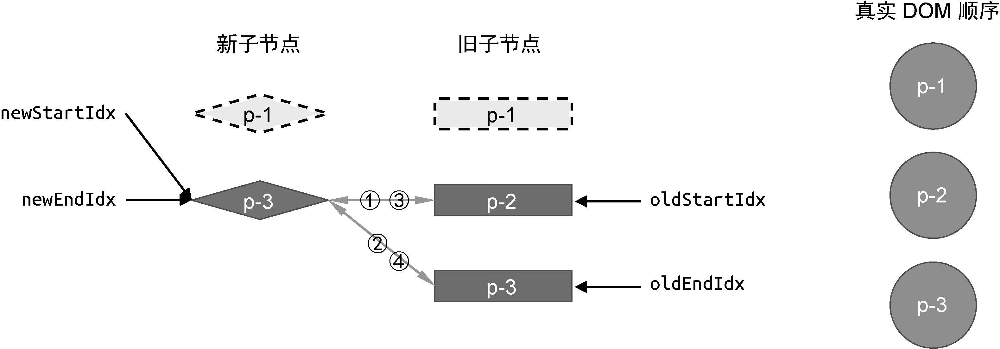

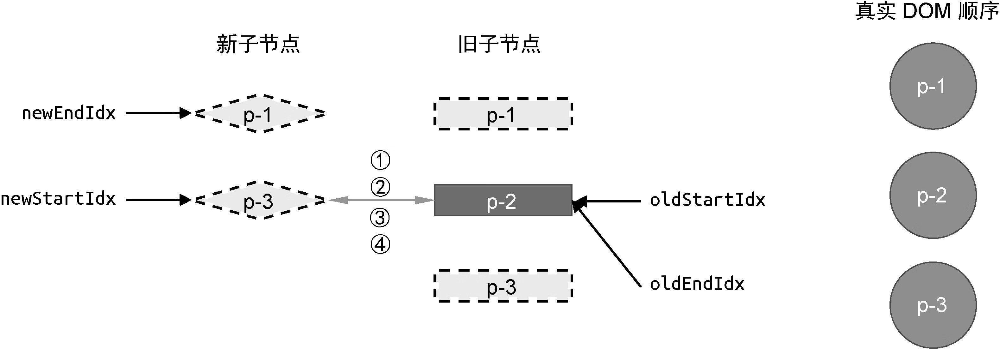

可以发现，当所有循环条件结束后，还剩余一个旧子节点未处理，此时可以在循环后再加一个条件处理

```js
while (oldStartIdx <= oldEndIdx && newStartIdx <= newEndIdx) {
  // ...
}
if (oldEndIdx < oldStartIdx && newStartIdx <= newEndIdx) {
  // 添加新节点
  // ...
} else if (newEndIdx < newStartIdx && oldStartIdx <= oldEndIdx) {
  // 移除操作
  for (let i = oldStartIdx; i <= oldEndIdx; i++) {
    unmount(oldChildren[i])
  }
}
```

双端 Diff 与 简单 Diff 相比有哪些优点：

1. 遍历次数更少
2. 操作 DOM 移动 DOM 的次数更少

## 快速 Diff 算法

不同于简单 Diff 算法和双端 Diff 算法，快速 Diff 算法包含预处理步骤，这其实是借鉴了纯文本 Diff 算法的思路。在纯文本 Diff 算法中，存在对两段文本进行预处理的过程。

首先对两段文本进行 Diff 之前，可以先对它们进行全等比较：

```js
if (text1 === text2) return
```

除此之外，预处理过程还会处理两段文本相同的前缀和后缀。假设有如下两段文本：

```js
TEXT1: I use vue for app development
TEXT2: I use react for app development
```

这两段文本的头部和尾部分别有一段相同的内容

<div>
  <div>TEXT1: <span style="background-color: var(--vp-c-divider);">I use</span> vue <span style="background-color: var(--vp-c-divider);">for app development</span></div>
  <div>TEXT2: <span style="background-color: var(--vp-c-divider);">I use</span> react <span style="background-color: var(--vp-c-divider);">for app development</span></div>
</div>

因此，对于 TEXT1 和TEXT2 来说，真正需要进行 Diff 操作的部分是

```js
TEXT1: vue
TEXT2: react
```

快速 Diff 算法借鉴了纯文本 Diff 算法中预处理的步骤，例如有如下新旧子节点

<Image src="./images/fast-diff-1.jpg" :max-width="420" />

可以根据上面的文本 Diff 方法，排除前后新旧子节点中的相同节点，代码如下

```js
function patchKeyedChildren(n1, n2, container) {
  const newChildren = n2.children
  const oldChildren = n1.children
  // 更新相同的前置节点
  let j = 0
  let oldVNode = oldChildren[j]
  let newVNode = newChildren[j]
  while (oldVNode.key === newVNode.key) {
    patch(oldVNode, newVNode, container)
    j++
    oldVNode = oldChildren[j]
    newVNode = newChildren[j]
  }

  // 更新相同的后置节点
  let oldEnd = oldChildren.length - 1
  let newEnd = newChildren.length - 1

  oldVNode = oldChildren[oldEnd]
  newVNode = newChildren[newEnd]

  // while 循环从后向前遍历，直到遇到拥有不同 key 值的节点为止
  while (oldVNode.key === newVNode.key) {
    // 调用 patch 函数进行更新
    patch(oldVNode, newVNode, container)
    oldEnd--
    newEnd--
    oldVNode = oldChildren[oldEnd]
    newVNode = newChildren[newEnd]
  }

}
```

排除掉相同的前后子节点后，还要处理中间新增的新子节点，如下

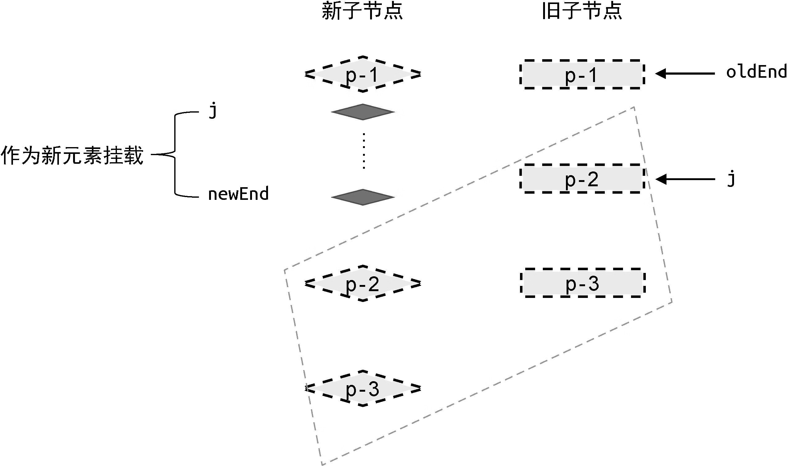

根据上图分析

- 条件一 `oldEnd < j` 成立：说明所有旧子节点都已处理完成。
- 条件二 `newEnd >= j` 成立：说明在新的一组子节点中，仍然有未被处理的节点。

如果上面两个条件都成立，就说明在新的一组子节点中，存在遗留节点，且这些节点都是新增节点。代码实现如下

```js
function patchKeyedChildren(n1, n2, container) {
  const newChildren = n2.children
  const oldChildren = n1.children
  // 更新相同的前置节点
  // ...

  // 更新相同的后置节点
  // ...

  // 从 j --> newEnd 之间的节点应作为新节点插入
  if (j > oldEnd && j <= newEnd) {
    // 锚点的索引
    const anchorIndex = newEnd + 1
    // 锚点元素
    const anchor = anchorIndex < newChildren.length ? newChildren[anchorIndex].el : null
    // 挂载新增节点
    while (j <= newEnd) {
      patch(null, newChildren[j++], container, anchor)
    }
  }

}
```

上面的案例展示了新增节点的情况，我们再来看看删除节点的情况

<Image src="./images/fast-diff-3.jpg" :max-width="420" />

处理完前后的相同节点后，会剩下一个部分未删除的节点

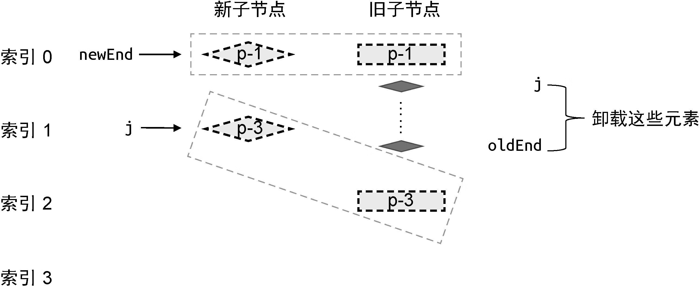

当满足条件 `j > newEnd && j <= oldEnd` 时，表示该节点是需要卸载的旧节点，实现代码如下

```js
function patchKeyedChildren(n1, n2, container) {
  const newChildren = n2.children
  const oldChildren = n1.children
  // 更新相同的前置节点
  // 省略部分代码

  // 更新相同的后置节点
  // 省略部分代码

  if (j > oldEnd && j <= newEnd) {
    // 省略部分代码
  } else if (j > newEnd && j <= oldEnd) {
    // j -> oldEnd 之间的节点应该被卸载
    while (j <= oldEnd) {
      unmount(oldChildren[j++])
    }
  }

}
```

### 判断是否需要进行 DOM 移动操作

上一节给出的例子比较理想化，当处理完相同的前置节点或后置节点后，新旧两组子节点中总会有一组子节点全部被处理完毕。在这种情况下，只需要简单地挂载、卸载节点即可。但有时情况会比较复杂，如下

<Image src="./images/fast-diff-5.jpg" :max-width="320" />

可以看到，与旧的一组子节点相比，新的一组子节点多出了一个新节点 p-7，少了一个节点 p-6。这个例子并不像上一节给出的例子那样理想化，我们无法简单地通过预处理过程完成更新。在这个例子中，相同的前置节点只有 p-1，而相同的后置节点只有 p-5。

处理完前置节点和后置节点后的状态

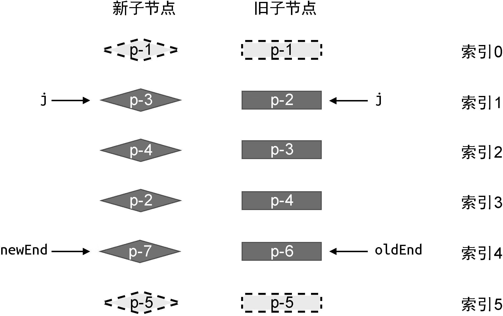

可以看到，经过预处理后，无论是新的一组子节点，还是旧的一组子节点，都有部分节点未经处理。怎么处理呢？其实无论是简单 Diff 算法，还是双端 Diff 算法，抑或本章介绍的快速 Diff 算法，它们都遵循同样的处理规则：

- 判断是否有节点需要移动，以及应该如何移动；
- 找出那些需要被添加或移除的节点。

所以接下来我们的任务就是，判断哪些节点需要移动，以及应该如何移动

上图的情况下，当相同的前置节点和后置节点被处理完毕后，索引 j、newEnd 和 oldEnd 不满足下面两个条件中的任何一个

- `j > oldEnd && j <= newEnd`
- `j > newEnd && j <= oldEnd`

因此我们需要增加条件分支条件来处理这种情况，如下

```js
function patchKeyedChildren(n1, n2, container) {
  const newChildren = n2.children
  const oldChildren = n1.children
  // 更新相同的前置节点
  // ...

  // 更新相同的后置节点
  // ...

  if (j > oldEnd && j <= newEnd) {
    // ...
  } else if (j > newEnd && j <= oldEnd) {
    // ...
  } else {
    // 增加 else 分支来处理非理想情况
  }

}
```

首先，我们需要构造一个数组 source，它的长度等于新的一组子节点在经过预处理之后剩余未处理节点的数量，并且 source 中每个元素的初始值都是 -1，如下

```js
if (j > oldEnd && j <= newEnd) {
  // 省略部分代码
} else if (j > newEnd && j <= oldEnd) {
  // 省略部分代码
} else {
  // count：新的一组子节点中剩余未处理节点的数量
  const count = newEnd - j + 1
  const source = new Array(count)
  source.fill(-1)
}
```

source 数组将用来存储新的一组子节点中的节点在旧的一组子节点中的位置索引，后面将会使用它计算出一个最长递增子序列，并用于辅助完成 DOM 移动的操作

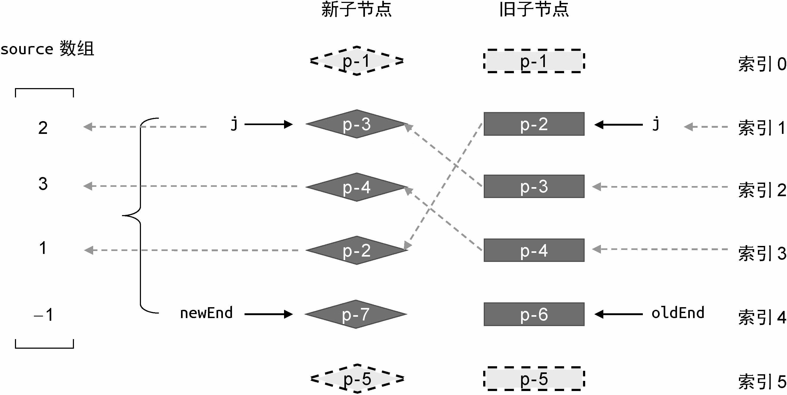

代码如下

```js
if (j > oldEnd && j <= newEnd) {
  // ...
} else if (j > newEnd && j <= oldEnd) {
  // ...
} else {
  const count = newEnd - j + 1
  const source = new Array(count)
  source.fill(-1)

  // oldStart 和 newStart 分别为起始索引，即 j
  const oldStart = j
  const newStart = j
  for (let i = oldStart; i <= oldEnd; i++) {
    const oldVNode = oldChildren[i]
    for (let k = newStart; k <= newEnd; k++) {
      const newVNode = newChildren[k]
      // 找到拥有相同 key 值的可复用节点
      if (oldVNode.key === newVNode.key) {
        patch(oldVNode, newVNode, container)
        // 填充 source 数组
        source[k - newStart] = i
      }
    }
  }
}
```

这段代码中我们采用了两层嵌套的循环，其时间复杂度为 O(n1 * n2)，其中 n1 和 n2 为新旧两组子节点的数量，我们也可以使用 O(n^2) 来表示。当新旧两组子节点的数量较多时，两层嵌套的循环会带来性能问题。出于优化的目的，我们可以为新的一组子节点构建一张**索引表**，用来存储节点的 key 和节点位置索引之间的映射，如下

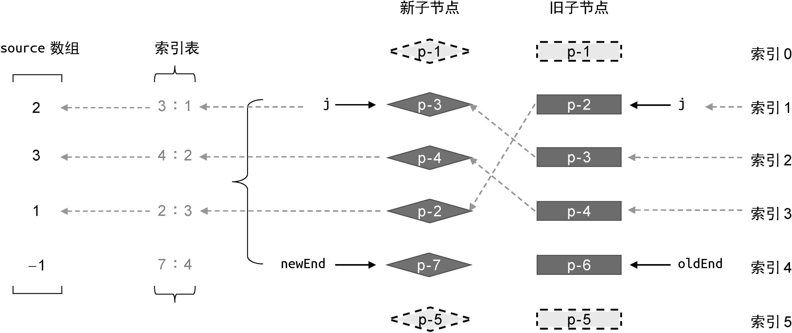

代码实现如下

```js
if (j > oldEnd && j <= newEnd) {
  // ...
} else if (j > newEnd && j <= oldEnd) {
  // ...
} else {
  const count = newEnd - j + 1
  const source = new Array(count)
  source.fill(-1)

  const oldStart = j
  const newStart = j
  // 构建索引表
  const keyIndex = {}
  for (let i = newStart; i <= newEnd; i++) {
    keyIndex[newChildren[i].key] = i
  }
  for (let i = oldStart; i <= oldEnd; i++) {
    oldVNode = oldChildren[i]
    const k = keyIndex[oldVNode.key]

    if (typeof k !== 'undefined') {
      newVNode = newChildren[k]
      patch(oldVNode, newVNode, container)
      source[k - newStart] = i
    } else {
      // 没找到
      unmount(oldVNode)
    }
  }
}
```

上述流程执行完毕后，接下来我们应该思考的是，如何判断节点是否需要移动。实际上，快速 Diff 算法判断节点是否需要移动的方法与简单 Diff 算法类似。

除此之外，我们还需要一个数量标识，代表已经更新过的节点数量。已经更新过的节点数量应该小于新的一组子节点中需要更新的节点数量。

如下面的代码所示

```js
if (j > oldEnd && j <= newEnd) {
  // ...
} else if (j > newEnd && j <= oldEnd) {
  // ...
} else {
  const count = newEnd - j + 1 // 新的一组子节点中剩余未处理节点的数量
  const source = new Array(count)
  source.fill(-1)

  const oldStart = j
  const newStart = j
  let moved = false
  let pos = 0
  const keyIndex = {}
  for(let i = newStart; i <= newEnd; i++) {
    keyIndex[newChildren[i].key] = i
  }
  let patched = 0 // 更新过的节点数量
  for(let i = oldStart; i <= oldEnd; i++) {
    oldVNode = oldChildren[i]
    // 如果更新过的节点数量小于等于需要更新的节点数量，则执行更新
    if (patched <= count) {
      const k = keyIndex[oldVNode.key]
      if (typeof k !== 'undefined') {
        newVNode = newChildren[k]
        patch(oldVNode, newVNode, container)
        patched++ // 每次更新 patched + 1
        source[k - newStart] = i
        if (k < pos) {
          moved = true
        } else {
          pos = k
        }
      } else {
        // 没找到
        unmount(oldVNode)
      }
    } else {
      // 如果更新过的节点数量大于需要更新的节点数量，则卸载多余的节点
      unmount(oldVNode)
    }
  }
}
```

现在，我们通过判断变量 moved 的值，已经能够知道是否需要移动节点，同时也处理了很多边界条件。接下来我们讨论如何移动节点。

### 如何移动元素

为了进行 DOM 移动操作，我们首先要根据 source 数组计算出它的最长递增子序列。source 数组仍然取用在 11.2 节中给出的例子，如图


首先，我们先要搞清楚什么是一个序列的递增子序列。简单来说，给定一个数值序列，找到它的一个子序列，并且该子序列中的值是递增的，子序列中的元素在原序列中不一定连续。一个序列可能有很多个递增子序列，其中最长的那一个就称为最长递增子序列。

举个例子，假设给定数值序列 [ 0, 8, 4, 12 ]，那么它的最长递增子序列就是 [0, 8, 12]。

理解了什么是最长递增子序列，接下来我们就可以求解 source 数组的最长递增子序列了，如下面的代码所示

```js
if (j > oldEnd && j <= newEnd) {
  // ...
} else if (j > newEnd && j <= oldEnd) {
  // ...
} else {
  // ...
  for(let i = oldStart; i <= oldEnd; i++) {
    // ...
  }

  if (moved) {
    // 计算最长递增子序列
    const seq = lis(sources) // [ 0, 1 ]
  }
}
```

source 数组 [2, 3, 1, -1] 的最长递增子序列应该是 [2, 3]，但我们得到的结果是 [0, 1]。这是因为 lis 函数的返回结果是最长递增子序列中的元素在 source 数组中的位置索引。

因为 source 数组的最长递增子序列为 [2, 3]，其中元素 2 在该数组中的索引为 0，而数组 3 在该数组中的索引为 1，所以最终结果为 [0, 1]


观察上图，我们忽略了经过预处理的节点 p-1 和 p-5。所以，索引为 0 的节点是 p-2，而索引为 1 节点是 p-3，以此类推。重新编号是为了让子序列 seq 与新的索引值产生对应关系。其实，最长递增子序列 seq 拥有一个非常重要的意义。以上例来说，子序列 seq 的值为 [0, 1]，它的含义是：在新的一组子节点中，重新编号后索引值为 0 和 1 的这两个节点在更新前后顺序没有发生变化。换句话说，重新编号后，索引值为 0 和 1 的节点不需要移动

为了完成节点的移动，我们还需要创建两个索引值 i 和 s：
- 用索引 i 指向新的一组子节点中的最后一个节点；
- 用索引 s 指向最长递增子序列中的最后一个元素。


接下来，我们将开启一个 for 循环，让变量 i 和 s 按照图11-24 中箭头的方向移动，如下面的代码所示

```js
if (moved) {
  const seq = lis(sources)

  // s 指向最长递增子序列的最后一个元素
  let s = seq.length - 1
  // i 指向新的一组子节点的最后一个元素
  let i = count - 1
  // for 循环使得 i 递减，即按照上图中箭头的方向移动
  for (i; i >= 0; i--) {
    if (i !== seq[s]) {
      // 如果节点的索引 i 不等于 seq[s] 的值，说明该节点需要移动
    } else {
      // 当 i === seq[s] 时，说明该位置的节点不需要移动
      // 只需要让 s 指向下一个位置
      s--
    }
  }
}
```

for 循环的目的是让变量 `i` 按照图中箭头的方向移动，以便能够逐个访问新的一组子节点中的节点。在 for 循环内，判断条件 `i !== seq[s]`，如果节点的索引 `i` 不等于 `seq[s]` 的值，则说明该节点对应的真实 DOM 需要移动，否则说明当前访问的节点不需要移动，但这时变量 `s` 需要按照图中箭头的方向移动，即让变量 `s` 递减

接下来我们就按照上述思路执行更新。初始时索引 i 指向节点 p-7。由于节点 p-7 对应的 source 数组中相同位置的元素值为 -1，所以我们应该将节点 p-7 作为全新的节点进行挂载，如下面的代码所示：

```js
if (moved) {
  const seq = lis(sources)

  let s = seq.length - 1
  let i = count - 1
  for (i; i >= 0; i--) {
    if (source[i] === -1) {
      // 说明索引为 i 的节点是全新的节点，应该将其挂载
      const pos = i + newStart // 该节点在新 children 中的真实位置索引
      const newVNode = newChildren[pos]
      // 该节点的下一个节点的位置索引
      const nextPos = pos + 1
      // 锚点
      const anchor = nextPos < newChildren.length
        ? newChildren[nextPos].el
        : null
      // 挂载
      patch(null, newVNode, container, anchor)
    } else if (i !== seq[s]) {
      // 如果节点的索引 i 不等于 seq[s] 的值，说明该节点需要移动
    } else {
      // 当 i === seq[s] 时，说明该位置的节点不需要移动
      // 只需要让 s 指向下一个位置
      s--
    }
  }
}
```

如果 `source[i]` 的值为 `-1`，则说明索引为 `i` 的节点是全新的节点，于是我们调用 patch 函数将其挂载到容器中。这里需要注意的是，由于索引 `i` 是重新编号后的，因此为了得到真实索引值，我们需要计算表达式 `i + newStart` 的值。

新节点创建完毕后，for 循环已经执行了一次，此时索引 i 向上移动一步，指向了节点 p-2，如图

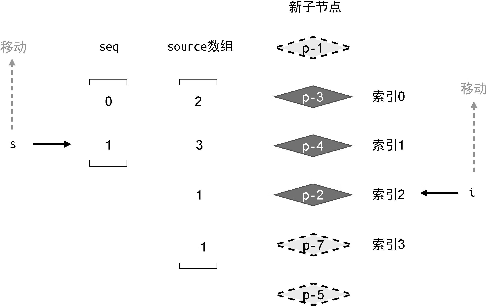

进行下一轮 for 循环，在运行到 `i !== seq[s]` 时。此时索引 i 的值为 2，索引 s 的值为 1。因此 2 !== seq[1] 成立，节点 p-2 所对应的真实 DOM 需要移动。代码实现如下

```js
if (moved) {
  const seq = lis(sources)

  // s 指向最长递增子序列的最后一个元素
  let s = seq.length - 1
  let i = count - 1
  for (i; i >= 0; i--) {
    if (source[i] === -1) {
      // ...
    } else if (i !== seq[s]) {
      // 说明该节点需要移动
      // 该节点在新的一组子节点中的真实位置索引
      const pos = i + newStart
      const newVNode = newChildren[pos]
      // 该节点的下一个节点的位置索引
      const nextPos = pos + 1
      // 锚点
      const anchor = nextPos < newChildren.length
        ? newChildren[nextPos].el
        : null
      // 移动 DOM
      insert(newVNode.el, container, anchor)
    } else {
      // 当 i === seq[s] 时，说明该位置的节点不需要移动
      // 并让 s 指向下一个位置
      s--
    }
  }
}
```

可以看到，移动节点的实现思路类似于挂载全新的节点。不同点在于，移动节点是通过 insert 函数来完成的。

接着，进行剩下的循环：

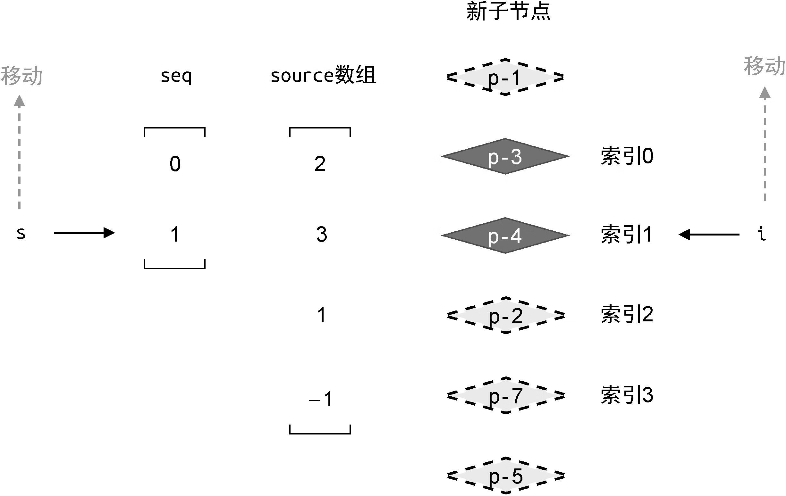

---

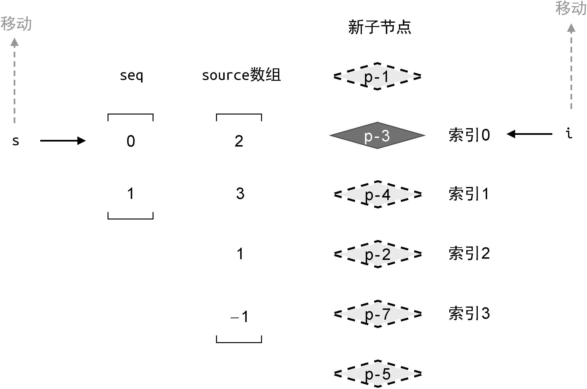

上面的循环最终条件都会走向 for 循环中最后一个 else 分支，即 `s--`。最后一次循环更新完成之后，循环将会停止，更新完成。

关于给定序列的递增子序列的求法不在本文的讲解范围内，网络上有大量文章讲解了这方面的内容，读者可以自行查阅。如下是用于求解给定序列的最长递增子序列的代码，取自 Vue.js 3

```js
function getSequence(arr) {
  const p = arr.slice()
  const result = [0]
  let i, j, u, v, c
  const len = arr.length
  for (i = 0; i < len; i++) {
    const arrI = arr[i]
    if (arrI !== 0) {
      j = result[result.length - 1]
      if (arr[j] < arrI) {
        p[i] = j
        result.push(i)
        continue
      }
      u = 0
      v = result.length - 1
      while (u < v) {
        c = ((u + v) / 2) | 0
        if (arr[result[c]] < arrI) {
          u = c + 1
        } else {
          v = c
        }
      }
      if (arrI < arr[result[u]]) {
        if (u > 0) {
          p[i] = result[u - 1]
        }
        result[u] = i
      }
    }
  }
  u = result.length
  v = result[u - 1]
  while (u-- > 0) {
    result[u] = v
    v = p[v]
  }
  return result
}
```


<style>
img {
  margin: 32px 0;
}
</style>