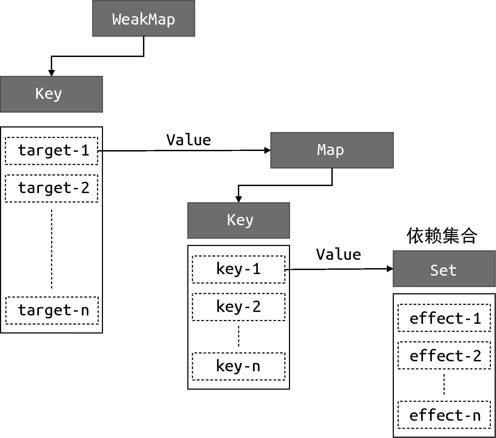
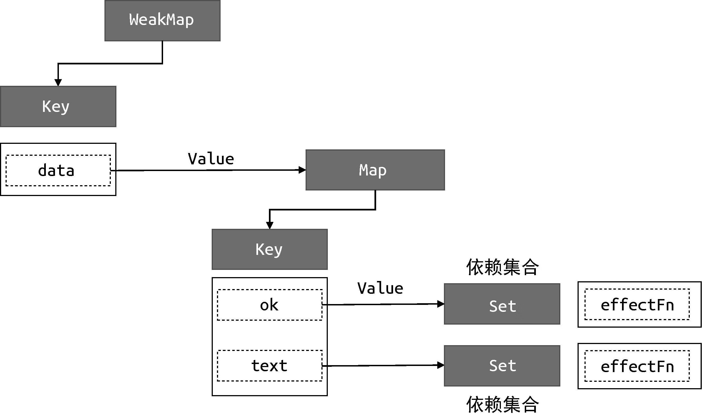
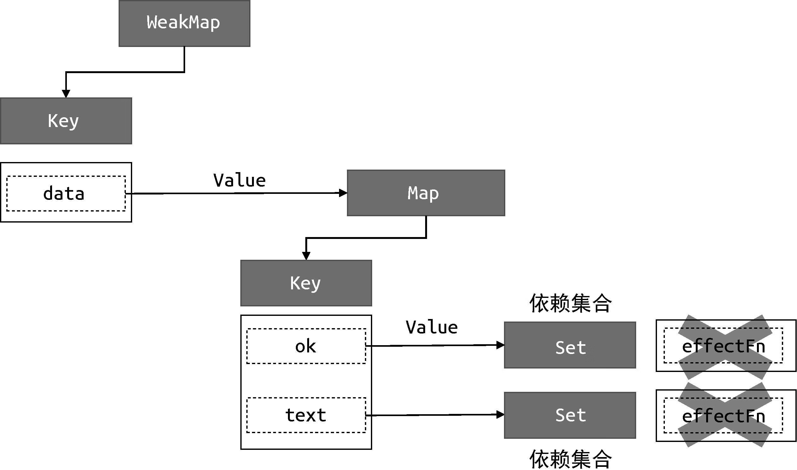

# 响应系统的作用与实现

## 副作用函数

副作用函数指的是会产生副作用的函数，如下面的代码所示：

```js
function effect() {
  document.body.innerText = 'hello vue3'
}
```

当 effect 函数执行时，它会设置 body 的文本内容，但除了 effect 函数之外的任何函数都可以读取或设置 body 的文本内容。也就是说，**effect 函数的执行会直接或间接影响其他函数的执行，这时我们说 effect 函数产生了副作用。**副作用很容易产生，例如一个函数修改了全局变量，这其实也是一个副作用，如下面的代码所示：

```js
// 假如它是全局变量
let val = 1

function effect() {
  val = 2 // 修改全局变量，产生副作用
}
```

## 响应式数据

我们希望以下 effect 在每次 obj.text 更新时执行，这就叫响应式数据

```js
const obj = { text: 'hello world' }
function effect() {
  // effect 函数的执行会读取 obj.text
  document.body.innerText = obj.text
}
```

如何让 obj 变为响应式的呢，我们发现以下特点：

- 当副作用函数 effect 执行时，会触发字段 obj.text 的读取操作。
- 当修改 obj.text 时，会触发字段 obj.text 的设置操作。

如果可以拦截对象的读取和设置，就好办了。当读取字段 obj.text 时，我们可以把副作用函数 effect 存到一个“桶”里。当设置 obj.text 时，再把 effect 从“桶”里拿出来并执行即可。

使用 Proxy 来实现该功能

```js
// 存储副作用
const bucket = new Set()

const data = { text: 'hello world' }
const obj = new Proxy(data, {
  get(target, key) {
    bucket.add(effect)
    return target[key]
  },
  set(target, key, newVal) {
    target[key] = newVal
    bucket.forEach(fn => fn())
    return true
  }
})
```

测试下修改该对象：

```js
function effect() {
  document.body.innerText = obj.text
}

effect()

setTimeout(() => {
  obj.text = 'hello vue3'
}, 1000)
```

在浏览器中运行上面这段代码，会得到期望的结果。

## 完善响应系统

上面代码中的响应系统，有很多缺点，比如由于 effect 没有与对象建立一一对应的关系，无法根据对象、对象的 key 区分 effect。我们可以封装一个树形结构，专门存放对应对象某个属性的 effect，该结构如下：



实现代码如下：

```js
const obj2 = new Proxy(data, {
  get(target, key) {
    track(target, key)
    return target[key]
  },
  set(target, key, newVal) {
    target[key] = newVal
    trigger(target, key)
  }
})

function track(target, key) {
  if (!activeEffect) return
  let depsMap = bucket.get(target)
  if (!depsMap) {
    bucket.set(target, (depsMap = new Map()))
  }
  let deps = depsMap.get(key)
  if (!deps) {
    depsMap.set(key, (deps = new Set()))
  }
  deps.add(activeEffect)
}

function trigger(target, key) {
  const depsMap = bucket.get(target)
  if (!depsMap) return
  const effects = depsMap.get(key)
  effects && effects.forEach(fn => fn())
}
```

## WeakMap 和 Map 的区别

用一段代码来解释：

```js
const map = new Map();
const weakmap = new WeakMap();

(function(){
  const foo = {foo: 1};
  const bar = {bar: 2};

  map.set(foo, 1);
  weakmap.set(bar, 2);
})()  
```

上面定义了一个立即执行的函数，在函数表达式内部定义了两个对象：foo 和 bar，这两个对象分别作为 map 和 weakmap 的 key。当该函数执行完毕后，对于对象 foo 来说，它仍然作为 map 的 key 被引用着，因此垃圾回收器（grabage collector）不会把它从内存中移除，我们仍然可以通过 map.keys 打印出对象 foo。然而对于对象 bar 来说，由于 WeakMap 的 key 是弱引用，它不影响垃圾回收器的工作，所以一旦函数执行完毕，垃圾回收器就会把对象 bar 从内存中移除，并且我们无法获取 weakmap 的 key 值，也就无法通过 weakmap 取得对象 bar（注：实际情况要看浏览器对 WeakMap 的实现）。

简单来说，WeakMap 是对 key 的弱引用，不影响垃圾回收器的工作。一旦 key 被垃圾回收，那么对应键和值就访问不到了。所以 WeakMap 经常用与存储哪些只有当 key 引用对象存在时才有价值的信息

## 分支切换

首先要明确分支切换的定义，如下代码所示：

```js
const data = { ok: true, text: 'hello world' }
const obj = new Proxy(data, { /* ... */ })

effect(function effectFn() {
  document.body.innerText = obj.ok ? obj.text : 'not'
})
```

effectFn 内部存在一个 obj.ok 值，当该值变化时，会执行不同分支的代码，这就是分支切换

但分支切换可能会产生遗留的副作用函数，导致 obj.ok 和 obj.text 对应的依赖都会收集 effectFn



这样即使代码中的 obj.ok 为 false，再次尝试修改 obj.text 的值

```js
obj.text = 'hello vue3'
```

副作用函数 effectFn 仍会执行

解决这个问题的思路很简单，每次副作用函数执行时，我们可以先把它从所有与之关联的依赖集合中删除，如图所示。



嵌套的effect与effect栈