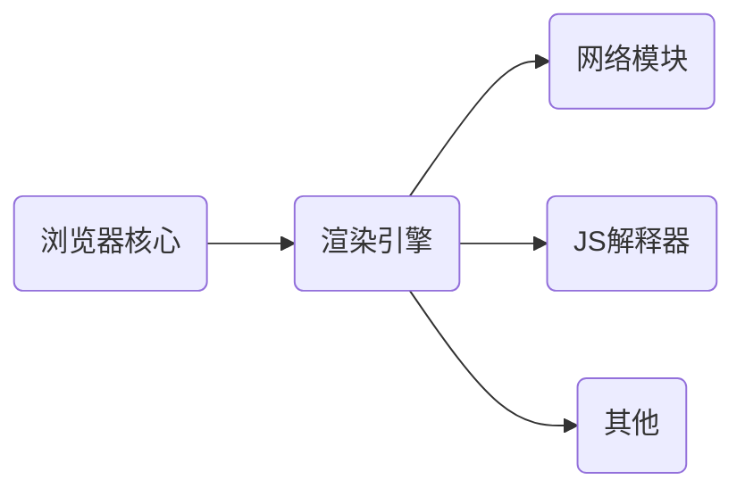
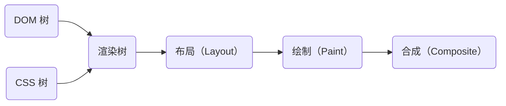

# 浏览器渲染原理

浏览器渲染过程

## HTML 解析过程

- 下载 HTML
- 解析 HTML
- 下载 CSS
- 解析 CSS
- 下载 JS （在此时停止解析 HTML，也就是所谓的阻塞 HTML 渲染）
- 解析 JS（解析完成后继续渲染 HTML）

CSS 的下载和执行会阻塞 JS 的执行，JS 的执行必须在 CSS 的下载和执行之后。这样 JS 才能获取到正确的 DOM 信息（例如元素高度）

## 为什么解析 HTML 时要等待 JS 下载并执行完毕才能继续解析？

- JS 的执行为什么会阻塞 HTML 渲染：因为执行 JS 的过程可能会修改 DOM 树。
- JS 的下载为什么会阻塞 HTML 渲染：因为过去的浏览器没有那么强大，所以只会在 看到 script 标签后才会去下载、解析，在这段时间都会被阻塞。
- 由于浏览器没有做额外的优化，就导致下载 JS 也会阻塞 HTML 解析（理论上可以不阻塞）。
- 总结：因为下载和执行会导致 DOM 树的修改。

## script async 和 defer 的区别

- script defer 和 script async 都可以 让 JS 的下载和 HTML 解析可以同时进行。
- script defer 可以保证 JS 的执行 是在 HTML 解析之后，DOM Ready 之前。
- 但 script async 的 JS 执行跟 DOM Ready 完全没有任何关联，script async 的 JS 下载完成就执行。
- 所以 script async 适合 JS 运行跟当前页面 DOM 毫无关系的内容（不会操作 DOM）。
- 且 script async 不保证 script 标签的先后执行顺序（请求到就执行），script defer 可以保证 script 标签的执行顺序。

::: info DOM Ready

DOM Ready 是指在文档对象模型 (DOM) 树形结构已经被构建完毕，且所有的DOM元素都已经可以被访问和操作时的一个状态。在此状态下，JavaScript代码可以安全地访问和操作DOM，而不会导致未定义的行为或错误。

:::

参考来自 [async vs defer attributes](https://www.growingwiththeweb.com/2014/02/async-vs-defer-attributes.html) 的图示：

## 页面渲染原理

浏览器渲染页面流程图

它的主要工作流程为

- DOM 和 CSSOM 树组合在一起形成渲染树。
- 渲染树只包含页面所需的节点。
- 布局：例如屏幕宽高、尺寸等
- 绘制：对元素颜色、阴影进行渲染
- 合成：把多层次的内容合并，比如两个叠加的 div 背景颜色不同，上面的就会覆盖下面的

关于渲染树的合成图（参考自：[Render-tree Construction, Layout, and Paint](https://web.dev/critical-rendering-path-render-tree-construction/)）

## reflow & repaint

- reflow（页面重新布局）：当你页面布局发生改变时，会进行 reflow（改变高度）
- repaint（页面重新绘制）：当你改变了一个页面元素的颜色、阴影等
- 每次页面重新绘制/或重新布局都会造成重新合成

这个网站记录了所有可能会造成重绘或重排的 CSS 属性：[CSSTriggers](https://csstriggers.com/)
