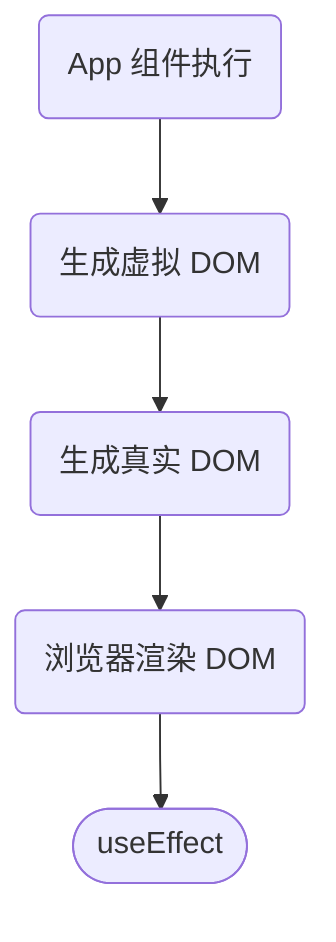
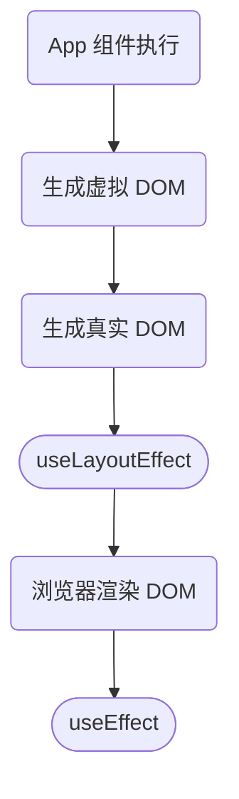

# React Hooks API

## useReducer

在组件中使用 Reducer

```js
import { useState, useReducer } from "react"

const initial = {
  n: 0
};

const reducer = (state, action) => {
  if (action.type === "add") {
    return { n: state.n + action.number };
  } else if (action.type === "multi") {
    return { n: state.n * 2 };
  } else {
    throw new Error("unknown type");
  }
};

function App() {
  const [state, dispatch] = useReducer(reducer, initial);
  const { n } = state;
  const onClick = () => {
    dispatch({ type: "add", number: 1 });
  };
  const onClick2 = () => {
    dispatch({ type: "add", number: 2 });
  };
  return (
    <div className="App">
      <h1>n: {n}</h1>

      <button onClick={onClick}>+1</button>
      <button onClick={onClick2}>+2</button>
    </div>
  );
}
```

可以结合 useContext，实现全局状态管理

```js
import React, { useReducer, useContext, useEffect } from "react"
import { ajax } from './ajax.js'

const store = {
  user: null,
  books: null,
  movies: null
};

function reducer(state, action) {
  switch (action.type) {
    case "setUser":
      return { ...state, user: action.user };
    case "setBooks":
      return { ...state, books: action.books };
    case "setMovies":
      return { ...state, movies: action.movies };
    default:
      throw new Error();
  }
}

const Context = React.createContext(null);

function App() {
  const [state, dispatch] = useReducer(reducer, store);

  const api = { state, dispatch };
  return (
    <Context.Provider value={api}>
      <User />
      <hr />
      <Books />
      <Movies />
    </Context.Provider>
  );
}

function User() {
  const { state, dispatch } = useContext(Context);
  useEffect(() => {
    ajax("/user").then(user => {
      dispatch({ type: "setUser", user: user });
    });
  }, []);
  return (
    <div>
      <h1>个人信息</h1>
      <div>name: {state.user ? state.user.name : ""}</div>
    </div>
  );
}

function Books() {
  const { state, dispatch } = useContext(Context);
  useEffect(() => {
    ajax("/books").then(books => {
      dispatch({ type: "setBooks", books: books });
    });
  }, []);
  return (
    <div>
      <h1>我的书籍</h1>
      <ol>
        {state.books ? state.books.map(book => <li key={book.id}>{book.name}</li>) : "加载中"}
      </ol>
    </div>
  );
}

function Movies() {
  const { state, dispatch } = useContext(Context);
  useEffect(() => {
    ajax("/movies").then(movies => {
      dispatch({ type: "setMovies", movies: movies });
    });
  }, []);
  return (
    <div>
      <h1>我的电影</h1>
      <ol>
        {state.movies
          ? state.movies.map(movie => <li key={movie.id}>{movie.name}</li>)
          : "加载中"}
      </ol>
    </div>
  );
}
```

ajax.js

```js
// 假 ajax
// 两秒钟后，根据 path 返回一个对象，必定成功不会失败
export function ajax(path) {
  return new Promise((resolve, reject) => {
    setTimeout(() => {
      if (path === "/user") {
        resolve({
          id: 1,
          name: "Frank"
        });
      } else if (path === "/books") {
        resolve([
          {
            id: 1,
            name: "JavaScript 高级程序设计"
          },
          {
            id: 2,
            name: "JavaScript 精粹"
          }
        ]);
      } else if (path === "/movies") {
        resolve([
          {
            id: 1,
            name: "爱在黎明破晓前"
          },
          {
            id: 2,
            name: "恋恋笔记本"
          }
        ]);
      }
    }, 2000);
  });
}

```

## useContext

从组件中获取 context，例如可以使用 context 切换当前 CSS 主题：

```js
import { useState, createContext, useContext } from "react";
import "./styles.css";

const themeContext = createContext(null);

function App() {
  const [theme, setTheme] = useState("light");
  return (
    <themeContext.Provider value={{ theme, setTheme }}>
      <div className={`App ${theme}`}>
        <p>{theme}</p>
        <ChildA/>
        <ChildB/>
      </div>
    </themeContext.Provider>
  );
}

function ChildA() {
  const { setTheme } = useContext(themeContext);
  return (
    <div>
      <button onClick={() => setTheme("light")}>light</button>
    </div>
  );
}

function ChildB() {
  const { setTheme } = useContext(themeContext);
  return (
    <div>
      <button onClick={() => setTheme("dark")}>dark</button>
    </div>
  );
}
```

## useEffect

用于执行副作用函数，只有在它的依赖项更新时才重新执行。



使用示例

```js
function App() {
  const [n, setN] = useState(0)
  const onClick = () => {
    setN(i => i + 1)
  }

  // [] 中的变量变化时执行，在此处为空，只会在第一次执行
  useEffect(() => {
    console.log('第一次渲染后执行')
  }, [])

  // n 变化时执行
  useEffect(() => {
    if (n !== 0) {
      console.log(`n 变化时执行`)
    }
  }, [n])

  // 不传第二个参数，默认为依赖所有 state
  useEffect(() => {
    console.log('任何 state 变化时都执行')
  })
}
```


### 函数式编程中的副作用概念

- 在I/O模型中，我们希望在在I到O之间只有计算，如果中间包含且不仅包含触发了其他I/O、与此次I -> O计算并不相关的任何事情，都称为副作用。
- React 纯函数组件：使用函数定义的React组件，它接收一定的输入（称为props）并返回一个React元素（通常是虚拟DOM）作为输出，没有内部状态或副作用。
- React 副作用函数组件：使用 useEffect 钩子函数来处理副作用的函数组件。副作用是指在组件渲染过程中可能会引起的与界面交互、数据获取、订阅事件等相关的操作。
- 所以副作用就是 I/O（读取/写入）之外的操作。

> I/O模型是指计算机系统中用于处理输入和输出操作的方式或模式。

### 为什么 Effect 在开发模式运行两次？

- 在开发环境下，如果开启严格模式，React 会在实际运行 setup 之前额外运行一次 setup 和 cleanup。
- 这是因为在严格模式之外，React 可能会多次运行你的钩子，因为它将渲染阶段分解成碎片，并可能暂停或重新启动工作。
- 因此 React 希望你的函数是纯函数，例如，使用相同的参数，它们具有相同的结果。出于这个原因，它希望能够调用你的钩子两次，它们应该有相同的结果。

## useLayoutEffect

在浏览器重新绘制屏幕之前触发的 effect。



运行以下代码

```js
const App = () => {
  const [value, setValue] = useState(0);

  useEffect(() => {
    document.querySelector('#a').innerText = `value: 1000`
  })

  return (
    <div id="a" onClick={() => setValue(0)}>value: {value}</div>
  )
}
```

你会发现页面总会在刷新后重新渲染时，先渲染 `value: 0` 再更新为 `value: 1000`。

为了避免这种情况，我们可以使用 useLayoutEffect

```js
const App = () => {
  const [value, setValue] = useState(0);

  useLayoutEffect(() => {
    document.querySelector('#a').innerText = `value: 1000`
  })

  return (
    <div id="a" onClick={() => setValue(0)}>value: {value}</div>
  )
}
```

## memo & useMemo

memo

- 只有在当前组件的 props 变化时才重新渲染。

useMemo

- 在每次重新渲染的时候能够缓存计算的结果。只有结果改变时才重新执行。

### 使用 memo

运行以下代码

```js
import { useState } from 'react'

funciton App() {
  const [a, setA] = useState(0)
  const [b, setB] = useState(0)

  const onClick = () => {
    setA(a + 1)
  }

  return (
    <div>
      <div>
        <button onClick={onClick}>update a: {a}</button>
      </div>
      <Child data={b}/>
    </div>
  )
}

const Child = (props) => {
  console.log('child 重新执行了')
  return <div>child: {props.data}</div>
}
```

会发现 每次点击 update a 按钮，`<Child/>` 组件也会一起更新，但它的状态没有任何变化。

此时就可以使用 memo，它可以让当前组件只有在 props 变化时重新 render

```js
import { useState, memo } from 'react'

funciton App() {
  const [a, setA] = useState(0)
  const [b, setB] = useState(0)

  const onClick = () => {
    setA(a + 1)
  }

  const onClick2 = () => {
    setB(i => i + 1)
  }

  return (
    <div>
      <div>
        <button onClick={onClick}>update a: {a}</button>
        <button onClick={onClick2}>update b: {b}</button>
      </div>
      <Child data={b}/>
    </div>
  )
}

const Child = memo((props) => {
  console.log('child 重新执行了')
  return <div>child: {props.data}</div>
})
```

这时，只有点击 update b 时，Child 才会重新执行。

但 memo 有个问题，如果你给他绑定一些事件函数，如下：

```js
import { useState, memo } from 'react'

funciton App() {
  const [a, setA] = useState(0)
  const [b, setB] = useState(0)

  const onClick = () => {
    setA(a + 1)
  }

  const onClickChild = () => {}

  return (
    <div>
      <div>
        <button onClick={onClick}>update a: {a}</button>
      </div>
      <Child data={b} onClick={onClickChild}/>
    </div>
  )
}

const Child = memo((props) => {
  console.log('child 重新执行了')
  return <div onClick={props.onClick}>child: {props.data}</div>
})
```

它还是会在 update a 时重新执行，这是因为，每次 App 重新执行都会返回一个新的 onClickChild 函数引用。

### 使用 useMemo

为了解决上面的问题，我们可以使用 useMemo

```js
import { useState, memo, useMemo } from 'react'

funciton App() {
  const [a, setA] = useState(0)
  const [b, setB] = useState(0)

  const onClick = () => {
    setA(a + 1)
  }

  const onClickChild = useMemo(() => {
    return () => {
      console.log(b)
    }
  }, [b])

  return (
    <div>
      <div>
        <button onClick={onClick}>update a: {a}</button>
      </div>
      <Child data={b} onClick={onClickChild}/>
    </div>
  )
}

const Child = memo((props) => {
  console.log('child 重新执行了')
  return <div onClick={props.onClick}>child: {props.data}</div>
})
```

上面的内容表示，只有 b 的值更新时，onClickChild 函数才会重新获取，这样就可以防止多次更新 onClickChild 函数。

### memo 的第二个参数

memo 可以传入第二个参数，它的值为一个自定义的比较函数。只有返回值为 false 时才更新组件。

例如实现一个只在 a 为奇数时更新的 Child 组件：

```js
import { useCallback, memo, useState } from "react";

function App() {
  const [a, setA] = useState(0)
  const onClick = useCallback(() => {
    setA((a) => a + 1)
  }, [])
  return (
    <div className="App">
      <button onClick={onClick}>点我</button>
      <Child a={a} />
    </div>
  )
}

const Child = memo(function Child(props) {
  console.log(`Child 更新了 ${props.a}`)
  return <div>我是 Child{props.a}</div>
}, (oldProps, newProps) => newProps.a % 2 === 0)
```

## useCallback

在重新 render 时缓存函数。它其实是 useMemo 的简写，用法如下：

```js
import { useCallback } from "react"
import { useState } from "react"

function App() {
  const [n, setN] = useState(0)

  const onClick = useCallback(() => {
    setN(n + 1)
  }, [n])

  // 相当于 useMemo 的如下代码
  // const onClick = useMemo(() => {
  //   return () => {
  //     setN(n + 1)
  //   }
  // }, [n])

  return (
    <div className="App">
      <div>n: {n}</div>
      <div><button onClick={onClick}>+1</button></div>
    </div>
  )
}
```

## useRef

它允许你引用渲染不需要的值。保持值的最新状态，但不会触发 UI 更新。

```js
import { useRef } from "react"

function App() {
  const count = useRef(0)
  const onClick = () => {
    count.current += 1
    console.log(count.current)
  }
  return (
    <div className="App">
      <div>count: {count.current}</div>
      <div><button onClick={onClick}>+1</button></div>
    </div>
  )
}
```

上面的代码点击 `onClick` DOM 并不会更新 `count.current`，但根据控制台的打印，可以知道 `count.current` 已经改变了。

如果想要在 useRef 时触发更新，可以添加一个 useState，如下：

```js
import { useRef, useState } from "react"

function App() {
  const count = useRef(0)
  const update = useState()[1]
  const onClick = () => {
    count.current += 1
    update(count.current)
  }
  return (
    <div className="App">
      <div>count: {count.current}</div>
      <div><button onClick={onClick}>+1</button></div>
    </div>
  )
}
```

这样每次修改 `count.current` 都可以同步更新。但，React 并不推荐这么做，因为这破坏了 React 数据不可变的思想。

## forwardRef

让组件可以通过 ref 属性引用内部 DOM 节点。

举个例子，如果我们想要引用一个组件的 DOM 节点，正常会这么写：

```jsx
import { useRef } from "react"

function App() {
  const buttonRef = useRef(null)
  return (
    <div className="App">
      <Button2 ref={buttonRef}>按钮</Button2>
    </div>
  );
}

const Button2 = props => {
  return <button className="red" {...props} />
}
```

上面的代码在控制台会报如下错误：

```js
Warning: Function components cannot be given refs. Attempts to access this ref will fail. Did you mean to use React.forwardRef()?
```

它提示你，如果使用函数组件，需要使用 `React.forwardRef()` 添加带 ref 的组件，如下：

```js
import React, { useRef } from "react"

function App() {
  const buttonRef = useRef(null)
  return (
    <div className="App">
      <Button3 ref={buttonRef}>按钮</Button3>
    </div>
  );
}

const Button3 = React.forwardRef((props, ref) => {
  return <button className="red" ref={ref} {...props}/>
})
```

这样就可以正常引用 DOM 了。

## useImperativeHandle

修改 ref 引用值，通常用在组件的 ref 引用值修改，如下：

```jsx
import { useRef, useImperativeHandle, forwardRef } from "react";

function App() {
  const ref = useRef(null)

  const onClick = () => {
    ref.current.focus()
  }
  return (
    <div className="App">
      <MyInput ref={ref} />
      <button onClick={onClick}>focus</button>
    </div>
  )
}

const MyInput = forwardRef(function MyInput(props, ref) {
  const inputRef = useRef(null);

  useImperativeHandle(ref, () => {
    return {
      focus() {
        inputRef.current.focus();
      },
      scrollIntoView() {
        inputRef.current.scrollIntoView();
      },
    };
  }, []);

  return <input {...props} ref={inputRef} />;
});

```

## useId

为辅助功能属性生成唯一 ID。

HTML 辅助功能属性，例如 aria-describedby 允许指定两个相关联的属性。例如，可以指定一个 input 由另一个 p 描述。

```html
<label>
  Password:
  <input type="password" aria-describedby="password-hint"/>
</label>
<p id="password-hint">
  The password should contain at least 18 characters
</p>
```

但是，像这样的固定 ID 在组件化中会导致多个组件重复 id，使用 useId 生成唯一属性 ID 避免这个问题

```js
import { useId } from 'react';

function PasswordField() {
  const passwordHintId = useId();
  return (
    <>
      <label>
        Password:
        <input type="password" aria-describedby={passwordHintId}/>
      </label>
      <p id={passwordHintId}>
        The password should contain at least 18 characters
      </p>
    </>
  );
}
```

## useDeferredValue

延迟更新 UI 的一部分。即：

- 在每次组件重新 render 时，如果当前值被修改了，会暂停渲染 UI，重新根据最新的值渲染 UI。

> 在 React 18 之前，渲染是同步的。这意味着一旦 React 开始渲染，在它完成渲染组件之前，没有什么可以阻止它。

```js
import { useState, useDeferredValue } from 'react';

function SearchPage() {
  const [query, setQuery] = useState('');
  const deferredQuery = useDeferredValue(query);
  // ...
}
```